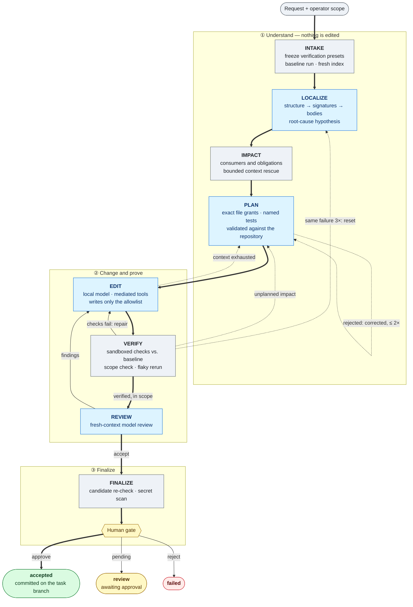

<div align="center">

# BoundedCode

**Code generation on an 8 GB GPU. Typed decisions inside the control loop.<br>
Nothing accepted without verification.**

[](https://github.com/akynte/boundedcode/actions/workflows/ci.yml)
[](LICENSE)
[](go.mod)
[](docs/how-to/install.md)
[](#hardware-and-measured-performance)

[Get started](#get-started) ·
[The 8 GB stack](#the-8-gb-stack) ·
[Architecture](docs/explanation/architecture.md) ·
[Verification](docs/explanation/verification.md) ·
[Trust boundaries](docs/explanation/trust-boundaries.md) ·
[Measurements](docs/benchmarks/results/2026-09-21-bonsai-runtime.md) ·
[Documentation](docs/index.md)

</div>

---

BoundedCode investigates repositories, plans scoped changes, edits code, and runs
verification on your machine. A Go supervisor surrounds local inference with a
code graph, bounded tools, persistent evidence, and a human approval gate.

|  |  |
|---|---|
| **Generation** | Local. Every token of code comes from your GPU; no prompt, file or conversation leaves the machine. |
| **Decisions** | Narrow, typed judgments about work in progress go to a hosted decision model, [TypeSafe Jev](#why-a-hosted-decision-model) — a required component, not an optional integration. [Exactly what leaves the machine](docs/explanation/judgment-data-flow.md). |
| **Acceptance** | Deterministic. Only the Go supervisor, from verification results, scope and candidate identity, can accept work. |
| **Hardware** | An **8 GB NVIDIA GPU and 64 GB system RAM**, running **Ternary Bonsai 2 27B (PTQ1_0)** for every generation phase (localization, planning, editing and review) through PrismML's llama.cpp fork. |

It is **not** a fully offline system, and does not claim to be. The engineering
goal is useful repository work on consumer hardware: spend the GPU budget on
generating a change; let software handle lookup, permissions, state, and checks.

> [!IMPORTANT]
> **Pre-1.0.** The task pipeline is implemented. The current reference model has
> been measured on an RTX 4060 Laptop GPU; broad task effectiveness on this stack
> is not yet established. Historical task evaluations use a different model and
> include false acceptances. Passing checks is evidence, not proof of correctness.

## Why an 8 GB budget changes the design

Running a coding model is only one part of running a coding agent. Repository
search, long conversations, repeated prompt ingestion, verification tools, and
competing inference processes all consume resources. A model that fits can still
produce a slow or unreliable workflow.

BoundedCode gives the model smaller, explicit problems:

- **Find relevant code.** SQLite FTS5, typed relationships, signature inspection,
  and targeted file reads support localization. The repository stays on disk.
- **Describe a bounded change.** A structured plan names exact writable files,
  tests, risks, and affected consumers. Code validates it before editing.
- **Act through a small tool surface.** Reads, exact edits, searches, impact
  queries, and predefined verification recipes. The native agent has no shell tool.
- **Use observable feedback.** Compiler errors, test failures, scope violations,
  and review findings feed bounded repair attempts.
- **Carry state outside the conversation.** A SQLite journal and persisted
  workflow state retain what ran, what changed, and what remains uncertain.

This is how the system seeks capability through architecture. It does not make a
local model equivalent to a frontier model, and the graph's benefit still needs
stronger experimental evidence.
[Read the design argument →](docs/explanation/why-small-models.md)

## What you can do

Ask for a bounded bug fix with a regression test, change a function signature and
investigate its consumers, or inspect configuration and service relationships.
You can also index a repository, query impact, and verify existing changes
without running inference.

```bash
bcode task create \
  --title "Check login and refresh-token handling for bugs. Fix the identified issue, add a regression test, and verify the authentication flow." \
  --scope "internal/auth/**,internal/handler/auth.go" \
  --verify standard
bcode task run <task-id> --diff
```

The request is an example of a task, not a published success result. Narrowing a
large audit to one demonstrable defect usually gives a clearer completion
criterion.

| Language / source | Evidence |
|---|---|
| Go | Compiler-backed analysis |
| TypeScript | Compiler relationships through a Node sidecar |
| Python | Optional SCIP indexing |
| Rust, SQL, protobuf/Avro, deployment manifests, Terraform, git history | Tree-sitter and format-specific analyzers, at differing levels of evidence |

[Language coverage and limits →](docs/explanation/repository-intelligence.md)

## The 8 GB stack

| Component | Job | Resource placement |
|---|---|---|
| **Ternary Bonsai 2 27B — PTQ1_0** | Localization, planning, editing, and a fresh-context review | Local llama-server; every layer resident on the GPU, 32,768-token context, Q8 KV cache |
| **Deterministic Go subsystems** | Indexing, scope enforcement, workflow state, verification, evidence | CPU, system RAM, SQLite, repository toolchains |
| **TypeSafe Jev — `jev-1.13.0`** (required) | Typed judgments inside the control loop | Hosted API; needs a credential; no local model allocation |
| **Qwen3-Embedding-0.6B — Q8_0** (experimental) | Embedding-cosine evaluation control | CPU-only reference service; not used by ordinary task retrieval |

Bonsai's language-model file is **5.95 GB on disk**. That is not its total runtime
VRAM requirement: KV cache, compute buffers, runtime overhead, and your desktop
also need memory. PTQ1_0 uses the Prism runtime's ternary kernels; the stock
llama.cpp binary in the shipped CUDA image is not the documented Bonsai runtime.

One model answers every role, so it stays resident: no phase waits for a model
swap, and editing runs at Bonsai's ~27 tokens/s. EDIT was once routed to a
second model because Bonsai looked unable to drive the tool loop. That was
BoundedCode's fault, not the model's: the edit prompt carried no code, because
qualified symbol names in plans matched nothing in the index.
[What was found, fixed and measured →](docs/reference/model-stack.md#why-edit-runs-on-bonsai)

**No hosted account is needed for generation.** A TypeSafe credential *is*
required, for the decision plane only: it sends a structured `state` object —
under the default `redact: strict`, repository metadata with no source in it —
and returns typed probabilities. It neither writes the patch nor supplies a
passing test result. The code and vendor call it **Jev**, not GEV.
[Exact models, roles, and evidence](docs/reference/model-stack.md) ·
[Jev's integration](docs/explanation/judgments.md)

## Why a hosted decision model

A coding agent makes two very different kinds of decision. Generating a change
is one; judging work in progress is the other, and for a long time this codebase
made the second kind with keyword lists and magic constants.

```text
SYSTEM TWO      Local coding model        Generates candidate solutions.
SYSTEM ONE      TypeSafe Jev              Fast typed judgments inside the loop.
DETERMINISTIC   Go supervisor + tools     State, policy, side effects, evidence,
                                          and the completion gate.
```

The bottom layer owns every decision that can accept work. That ordering is the
product.

| | |
|---|---|
| **What goes to Jev** | Eleven narrow, typed questions over bounded, structured state the supervisor already has: an objective, a plan's waivers, a window of tool-call evidence, a set of diff hunks. Never a transcript, never free text, never a whole file. |
| **What leaves** | One HTTPS request per consultation, carrying a `state` object whose contents the `redact` mode bounds. [The full data flow](docs/explanation/judgment-data-flow.md). |
| **What stays local** | Generation, the code graph, retrieval, the sandbox, every verification command, the ledger, telemetry. |
| **What stays deterministic** | Acceptance. Scope enforcement. What a verification command reports. |
| **Low confidence** | Not treated as an answer. The operator's `min_confidence` floor is applied to every choice and score a routing-capable site reads; below it the site reports `JEV_LOW_CONFIDENCE` rather than acting on a guess. |
| **Unavailable** | Explicit failure, never a silent default. A task run will not start without a usable decision plane, and a site configured to act on a decision it could not get stops the task in a resumable `blocked` state naming the class — `JEV_UNAVAILABLE`, `JEV_AUTH_FAILED`, `JEV_TIMEOUT` and the rest — rather than assuming the benign answer. |

A judgment may reorder evidence, raise a concern, taint a result, or send a plan
back for correction inside budgets the supervisor already enforces. It may not
accept work, reject work, or change what counts as success. This is enforced,
not documented: `internal/policy`, `internal/firewall`, `internal/broker` and
`internal/recipe` cannot import the judgment package at all, and a test fails the
build if that changes.

<details>
<summary><b>Why not ask the coding model, or keep the heuristics?</b></summary>
<br>

**Why not ask the coding model?** Because a generative model asked to judge its
own work is a model voting on itself, and because the answer needed is a
calibrated number, not prose. `Router.For(role)` falls through to the default
provider for any unrouted role — so putting a judge behind a generator role
would mean that when no judge is configured, the local coding model silently
answers classification questions instead. That is the failure this design
exists to remove.

**Why not heuristics?** They are still there, and they still run. The point is
that some of the decisions code was left holding are *semantic* — "does this
stated reason actually justify leaving that consumer alone", "is this diff hunk
weakening the test or legitimately updating it" — and a regex over prose is a
bad instrument for them. Nearly every such site in this repository carries a
comment admitting the heuristic. Honesty is not accuracy.

**Why this helps an 8 GB machine.** The scarce resource is GPU seconds. Every
semantic question answered by a small typed request is a question that does not
become another pass through a 27B model on a card that holds one model at a
time.

</details>

> [!NOTE]
> **What is not yet established.** The six routing-capable sites route by
> default, bounded by `redact` — under the shipped `strict` that is
> `intake_profile` and `obligation_reason`, the two whose questions are
> metadata-only. That is a product decision, not a measured one: no site has
> yet been shown to improve a decision in this system on real tasks, because
> its calibration on this kind of work has not been measured. `bcode judgment
> calibrate` exists to make that assessment from ordinary runs, and any site
> can be turned down to `logged` in `judgment.yaml` with one line.

<sub>TypeSafe and Jev are products of TypeSafe; this project is not affiliated
with or endorsed by them.</sub>

## How a task works

Eight persisted phases, with every transition checked against an allow-list
(`internal/workflow/state.go`). The model proposes; the supervisor decides where
the task goes next.



<sub>Blue phases call the local model; grey phases are deterministic Go; the
hexagon is a person. Thick arrows are the path to acceptance; dotted arrows are
bounded recovery routes.</sub>

**The model's `done` call cannot accept its own work.** The supervisor checks
verification results, scope, and candidate identity. Model review is an
additional fallible gate: it can request repairs; it cannot turn failed checks
into passes, and `VERIFY → FINALIZE` is a forbidden transition — review is never
skipped. Final approval commits on the task branch. Applying that commit to your
branch is a separate git operation.
[Verification contract →](docs/explanation/verification.md)

Any phase can also stop the task. Every stop is persisted with its reason:

| End state | When | Next |
|---|---|---|
| **accepted** | The gate approved; the change is committed on the task branch | Merge the branch yourself |
| **review** | Verified and reviewed, waiting at the gate | `bcode gate show`, approve, `bcode task retry` |
| **blocked** | A budget ran out, the environment failed, the decision plane was unusable, or the code changed underneath the task | Fix the named cause, then `bcode task retry` |
| **failed** | Repair, re-plan or re-localization budgets are exhausted, or the work was rejected | Start a new task |

<details>
<summary><b>Where Jev is consulted along the way</b></summary>
<br>

| Phase | Site | What it may do, at the routing tier |
|---|---|---|
| INTAKE | intake profile | Stop a task that needs a new dependency or a migration before any model call |
| PLAN | obligation reasons | Send back a plan whose `no_change_needed` waiver looks unsupported |
| EDIT | progress | Draw a context boundary when the loop circles (at most 3); flag drift as a risk |
| EDIT → VERIFY | test integrity, diff conformance | Taint results whose diff weakens a test; return an off-objective diff to EDIT once |
| VERIFY | triage | Pause on a judged environmental failure; re-localize a recurring cause |
| REVIEW | review rubric | Change the order the reviewer reads hunks in — nothing else |
| Context assembly | hypothesis, fact relevance, injection, note relevance | Shape what a model call is shown |

Under the shipped `redact: strict`, only intake profile and obligation reasons
act; the rest run and journal. None of them can accept or reject work.

</details>

## Get started

The reference path is **Linux x86-64 + NVIDIA CUDA**, with host inference and the
native `bcode` CLI. Setup includes a runtime build and a model download; it is not a
one-command installation.

### 1. Install the prerequisites

Go **1.27.1** or newer, a C compiler (the build uses cgo), git, and ripgrep.
Distribution `golang` packages are usually too old, so install Go from the
official release:

```bash
sudo apt install build-essential git ripgrep   # or your distribution's equivalent
curl -LO https://go.dev/dl/go1.27.1.linux-amd64.tar.gz
sudo rm -rf /usr/local/go && sudo tar -C /usr/local -xzf go1.27.1.linux-amd64.tar.gz
echo 'export PATH="$PATH:/usr/local/go/bin"' >> ~/.bashrc && source ~/.bashrc
go version   # must print go1.27.1 or newer
```

> [!TIP]
> If `make build` fails with `go: command not found`, Go is not installed or
> `/usr/local/go/bin` is not on your `PATH`.

### 2. Build the CLI

```bash
git clone https://github.com/akynte/boundedcode.git
cd boundedcode
make build
export PATH="$PWD/bin:$PATH"
export BC_DATA="$HOME/.local/share/boundedcode"
bcode config init
```

### 3. Install the runtime and models

Follow the [8 GB installation guide](docs/how-to/install.md) for the **pinned
Prism runtime, exact GGUF download, checksum, and configuration files**. Host
mode has a narrower isolation boundary than a container.

### 4. Configure the decision plane

`bcode task run` refuses to start without one:

```bash
cat > "$BC_DATA/config/judgment.yaml" <<'YAML'
enabled: true
model: jev-1.13.0
api_key_env: TYPESAFE_API_KEY
redact: strict
min_confidence: 0.75
cache: true
YAML
export TYPESAFE_API_KEY="…"
```

`redact: strict` is the default and sends no source. Read [what leaves the
machine](docs/explanation/judgment-data-flow.md) before loosening it.

### 5. Run your first task

Once the model server is running, use a clean, committed repository with its
dependencies already available:

```bash
cd /path/to/your/repository
bcode workspace init
bcode index
bcode models health
bcode doctor
bcode task create --title "Fix the failing parser test without changing its expected behavior" \
  --scope "internal/parser/**" --verify standard
bcode task run <task-id> --diff
```

Replace the paths and task with ones that exist in your repository.

- **`bcode doctor`** exits 0 when clean, 1 on warnings, and 2 on failures. It is the
  command that diagnoses a broken decision plane, and it keeps working when the
  plane is down — a missing credential, an unreachable endpoint, or a site
  promoted to a tier its `redact` mode forbids are each reported by name.
- **If work reaches a gate,** inspect it with `bcode gate list` and
  `bcode gate show <gate-id>`, approve explicitly, then `bcode task retry <task-id>`.

**Next:** the [first coding task tutorial](docs/tutorials/first-task.md) is a
self-contained example. For editor integration, see
[OpenCode and MCP](docs/how-to/use-with-opencode.md); editor-driven sessions have
a different working-tree boundary.

## Hardware and measured performance

| Reference observation, 2026-09-21 | Value |
|---|---|
| GPU | RTX 4060 Laptop, 8,188 MiB |
| Host | Intel i7-13620H, 64 GB installed RAM |
| Model / server | Bonsai PTQ1_0 / Prism llama.cpp `1a07bfa5` |
| Context / concurrent server slots | 32,768 / 1 |
| Prompt processing / generation | **264.4 / 27.7 tokens/s** |
| Highest post-request whole-device memory sample | 7,691 MiB |

Three synthetic requests; approximately 2K prompt tokens and a 256-token output
cap, with thinking disabled. These are server throughput observations, not coding
task timings, continuous peak-memory measurements, or a success rate.
[Raw data, flags, caveats, reproduction →](docs/benchmarks/results/2026-09-21-bonsai-runtime.md)

The [8 GB runtime guide](docs/explanation/8gb-runtime.md) explains RAM, disk,
context budgets, caching, process ownership, and untested hardware. The
[benchmark index](docs/benchmarks/results/README.md) keeps older Qwen/MoE task
results separate from the current Bonsai measurement.

## When a task stops

A task stops for reasons unrelated to the code it was changing: a wall-clock
budget expires, an operator interrupts, a deadline fires. Three things have to
be true at once, and the obvious implementation of the first breaks the second.

1. **Work stops.** The task's context reaches the subprocesses an evaluation
   runs — `git clone`, `docker run`, `docker exec`, the Python interpreter —
   through `exec.CommandContext`, rather than leaving a clone cloning and a
   container sleeping while only the Go code gives up.
2. **Cleanup still runs.** If that same context reached `docker stop`, every
   cancelled run would leak the container it started. Cleanup detaches from the
   cancellation and keeps a 30-second ceiling of its own, so stopping the work
   does not mean abandoning it.
3. **The evidence survives.** The record explaining why a task stopped is most
   useful at exactly the moment the budget kills everything else, so the final
   write detaches too — under a bound matching the ledger's, because a
   diagnostic must never be able to hang the thing it is observing. Budget
   exhaustion says so by name instead of surfacing as whatever call happened to
   be in flight.

Evaluation writes that leave the tool's own directory are resolved through
every symlink and refused if they land outside the run root. That is a check on
those writes, not a general filesystem sandbox.
[How cancellation, cleanup and evidence fit together →](docs/explanation/reliability.md)

## Safety and limits

Native edits happen in a separate task worktree, with path and policy checks.
Verification runs repository code under the available sandbox. Evidence is
stored by content hash; verification itself runs on a **writable** worktree,
not an immutable snapshot.

Container mounts, Landlock, and optional bubblewrap provide different
boundaries. Landlock alone is not complete network isolation. Treat the
supervisor, runtime, toolchains, and verification configuration as trusted.

> [!WARNING]
> The HTTP API has no built-in authentication and should remain on loopback.

The decision plane is a network dependency, so it is also a trust boundary:
BoundedCode sends a bounded, structured description of your work to a third
party, and what that description may contain is set by `redact` and enforced by
the state type, the egress-sensitivity check and a credential scan on every
field. [What leaves the machine](docs/explanation/judgment-data-flow.md) ·
[Security boundaries](docs/explanation/trust-boundaries.md) ·
[Report a vulnerability](SECURITY.md)

The current limits include multi-minute reasoning calls, incomplete language
relationships, manual setup, and no representative success-rate result for
Bonsai. GPU serialization is local to a `bcode` process; it cannot stop another
program consuming VRAM. [Full limitations →](docs/explanation/known-limitations.md)

## Contribute

The most useful contributions improve this coherent 8 GB system: reproducible
hardware reports, real regression tasks, analyzer correctness, verification
coverage, and installation reliability.
[Development and contribution guide →](CONTRIBUTING.md)

If you try it on an 8 GB GPU, a report with the exact runtime, checks, timings,
and failure cases is especially valuable. Star the repository to follow the
runtime work and upcoming reproducible end-to-end evaluations.

## License and acknowledgements

[Apache-2.0](LICENSE). Built with Go, SQLite, llama.cpp, tree-sitter, compiler
tooling, Linux sandboxing, and Docker. The reference models come from
[Prism ML](https://huggingface.co/prism-ml/Ternary-Bonsai-2-27B-gguf) and
[Qwen](https://huggingface.co/Qwen), and the required hosted judgments from
[TypeSafe](https://typesafe.ai/).
