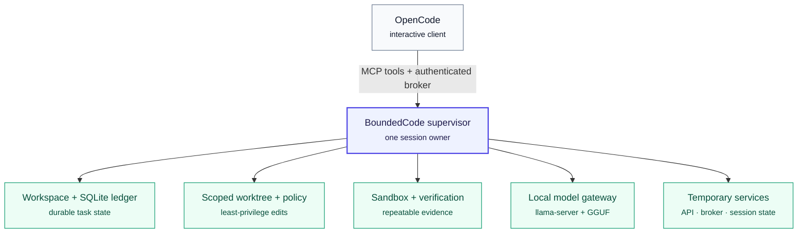

<div align="center">

<p><strong>LOCAL-FIRST · SUPERVISED · OPEN SOURCE</strong></p>

# BoundedCode

<p><strong>OpenCode's local control plane.</strong></p>

<p><em>A coding model that can propose changes, inside a runtime that decides what is allowed to happen.</em></p>

[](https://github.com/akynte/boundedcode/actions/workflows/ci.yml)
[](LICENSE)
[](go.mod)
[](https://opencode.ai/)
[](#limits--transparency)

[Quick start](#the-short-version) · [Architecture](#architecture) · [Setup](#install-boundedcode) · [Daily use](#use-boundedcode-from-any-project) · [Docs](#documentation)

</div>

---

> [!TIP]
> **The shortest path to a governed coding session:** install `bcode`, run
> `bcode setup` once, then run `bcode opencode` from any project.

## The short version

```text
┌──────────────────────────────────────────────────────────────┐
│  ONE-TIME                                                    │
│  bcode setup        discover · configure · validate           │
└──────────────────────────────┬───────────────────────────────┘
                               │
                               ▼
┌──────────────────────────────────────────────────────────────┐
│  EVERY SESSION                                               │
│  bcode opencode     prepare · launch · supervise · clean up  │
└──────────────────────────────────────────────────────────────┘
```

There is one official installation and configuration flow: **`bcode setup`**.
The old host installer, manual model-server recipes, and alternate setup
sequences are not part of the supported workflow.

## Why BoundedCode

BoundedCode is an open-source development environment for **OpenCode**. It keeps
the coding model, repository state, tools, and verification inside one supervised
boundary instead of asking developers to start a collection of services by hand.

| ✦ Local generation | ◈ Repository intelligence | ⚙ Deterministic control |
|---|---|---|
| Run the coding model on your machine with an OpenAI-compatible runtime. | Compiler-backed index, symbol relationships, targeted retrieval, and durable task memory. | Scoped edits, sandboxed verification, evidence, and completion decisions the model cannot grant itself. |
| **Your source stays local.** | **Context is assembled from the code, not vibes.** | **A passing check is evidence—not a model's claim of success.** |

The local model generates code on the developer's machine. A hosted
[TypeSafe Jev](https://typesafe.ai/) decision plane is a separate, narrow
control-plane component; setup configures it and explains the data boundary
before it is used. It can stop or redirect work, but it cannot turn a failed
check into an accepted change.

> [!NOTE]
> The normal supported path uses an **embedded** model owned by the session.
> An explicitly configured external endpoint remains operator-owned and is
> never killed by BoundedCode.

## Architecture



The supervisor owns every process it starts. OpenCode launches only after the
runtime is ready. On exit, the supervisor closes the OpenCode process tree,
stops the model and API children, checkpoints storage, removes the broker
capability and temporary session directory, and waits for process groups to
disappear.

### Ownership at a glance

| Layer | Responsibility | Lifetime |
|---|---|---|
| **OpenCode** | Conversation and interactive work surface | One editor session |
| **Supervisor** | Readiness, policy, process ownership, and shutdown | One editor session |
| **Model runtime** | Local generation and OpenAI-compatible endpoint | Started and stopped by the session |
| **Workspace data** | Indexes, ledger, evidence, and durable OpenCode state | Across sessions |
| **External endpoint** | Operator-provided inference service | Operator-owned |

## System requirements

The measured reference is **Linux x86-64 with an NVIDIA CUDA GPU**.

| Requirement | Reference target |
|---|---|
| **GPU** | NVIDIA CUDA, 8 GB VRAM (RTX 4060 Laptop is the measured reference) |
| **System RAM** | 64 GB recommended; allow at least 32 GB for smaller profiles |
| **Disk** | 20 GB free for the runtime, model, build caches, and project data |
| **OS** | Linux x86-64 |
| **Tools** | Git, ripgrep, a C compiler when building from source, and OpenCode 2 |
| **Optional CUDA build** | CMake, Ninja, `nvcc`, and an NVIDIA driver |
| **Runtime** | A CUDA-compatible `llama-server` and a GGUF model; setup can build the pinned Prism runtime after confirmation |
| **Decision plane** | A TypeSafe Jev credential for task execution |

The setup TUI reports the actual host, dependency, GPU, disk, and sandbox
checks. A CPU-only or Apple-silicon machine can use a measured profile or a
local OpenAI-compatible external endpoint, but it is not silently treated as
the CUDA reference machine.

> [!WARNING]
> The reference configuration is measured, not universal. Treat the published
> profile as a starting point and use `bcode doctor` to inspect what is actually
> active on your host.

## Install BoundedCode

The canonical installation has two parts: install the `bcode` executable, then
run its setup TUI. The TUI is the only supported way to install and configure
the runtime, model, sandbox, and initial settings.

### 1. Install the executable

From a checkout:

```bash
git clone https://github.com/akynte/boundedcode.git
cd boundedcode
make build
install -Dm755 bin/bcode "$HOME/.local/bin/bcode"
export PATH="$HOME/.local/bin:$PATH"
```

### 2. Run the guided setup

```bash
bcode setup
```

The TUI is safe to run again after an update or a hardware change. It detects
existing configuration, asks before replacing values, and writes an installation
marker only after validation succeeds. For automation, the same state-changing
path is available with explicit flags such as `--non-interactive`,
`--install-runtime`, `--yes`, `--runtime`, `--model`, and `--external-url`;
there is no second installation script or hand-written runtime recipe.

### What setup configures

| Step | What happens |
|---|---|
| **01 · Requirements** | Checks platform, Git, ripgrep, compiler, OpenCode, sandbox tools, NVIDIA driver, optional CMake/Ninja/`nvcc`, memory, and filesystem. |
| **02 · Data directory** | Selects `$BC_DATA` or a user-local data directory and creates it with durable permissions. |
| **03 · Hardware profile** | Selects a shipped profile or preserves an existing measured profile, and explains mismatches. |
| **04 · Runtime** | Discovers or accepts `llama-server`; can build the pinned Prism source after confirmation. |
| **05 · Model** | Discovers a GGUF or offers an atomic, resumable reference-model download. |
| **06 · Providers** | Creates the local OpenAI-compatible mapping used by both the supervisor and OpenCode. |
| **07 · Decision plane** | Configures Jev and stores supplied credentials outside YAML with owner-only permissions. |
| **08 · Validation** | Checks the strongest available isolation layer, validates generated files, and refuses false success. |

For unattended first-time setup, authorize the optional runtime build and model
download explicitly:

```bash
bcode setup --non-interactive --yes
```

Or, when the model already exists:

```bash
bcode setup --non-interactive --install-runtime --model /path/to/model.gguf
```

A runtime that is already discovered is reused. A generic pre-existing
`llama-server` is operator state: setup does not claim that an arbitrary binary
is the pinned Prism build, so use the approved build or pass the path of a
runtime you trust for your model.

> [!SUCCESS]
> After setup, no model server, API process, sandbox helper, or environment
> process needs to be started separately. `bcode opencode` owns that startup and
> shutdown boundary.

## Use BoundedCode from any project

After setup, the only command needed for normal use is:

```bash
cd /path/to/your/project
bcode opencode
```

BoundedCode automatically:

- finds or creates the workspace marker for the current project;
- creates private per-session OpenCode state and temporary directories;
- starts the configured local model runtime and supervisor/API services;
- waits for model and service readiness;
- registers the BoundedCode MCP tools and supervised agent;
- selects and prepares the strongest safe sandbox available on the host;
- launches OpenCode with the model and tools already wired;
- tears down everything it owns when OpenCode exits.

The explicit spelling `bcode opencode run` remains available for scripts, but
it has the same lifecycle as the short command. `bcode opencode setup` only
refreshes project-side registration; it is not a required installation step.

Arguments after `--` are passed to OpenCode unchanged:

```bash
bcode opencode -- --continue
```

## Automatic lifecycle

```mermaid
flowchart LR
    A["bcode opencode"] --> B["Prepare workspace"]
    B --> C["Start owned services"]
    C --> D["Validate readiness + context"]
    D --> E["OpenCode runs"]
    E --> F["Stop in reverse order"]
    F --> G["Close storage + remove session state"]
    G --> H["Idle resource state"]

    classDef action fill:#eef2ff,stroke:#4f46e5,color:#1e1b4b
    classDef terminal fill:#ecfdf5,stroke:#059669,color:#064e3b
    class A,B,C,D,F,G action
    class E,H terminal
```



### Automatic cleanup

The session boundary is a lifecycle boundary, not a best-effort convention.
When OpenCode exits normally, returns an error, or receives an interrupt,
BoundedCode performs an ordered shutdown:

1. stop the OpenCode process and its descendants;
2. stop the session broker and remove its bearer capability;
3. ask the supervisor to stop its model child and other services in reverse
   dependency order;
4. terminate the supervisor process group if graceful shutdown exceeds its
   grace period;
5. checkpoint and close SQLite storage;
6. remove the session's XDG state, temporary files, logs, and broker data.

The result is the important part: the LLM process is gone, GPU VRAM is released,
temporary runtime resources are removed, and BoundedCode-owned CPU and RAM
consumers stop. The launcher waits for termination rather than merely returning
to the shell, so a second `bcode opencode` starts from a clean session boundary.

> [!IMPORTANT]
> A process explicitly configured as **external** is not BoundedCode-owned and
> is not killed. The supported setup configures an embedded model precisely so
> the usual workflow has an unambiguous cleanup owner. `bcode doctor` reports
> the active ownership and isolation layers.

## Maintain with confidence

| Task | Command | What it does |
|---|---|---|
| **Update** | `bcode setup` | Preserves the data directory, runs forward-only schema migration, and refreshes generated configuration. |
| **Reconfigure** | `bcode setup` | Reopens the same guided flow for hardware, model, runtime, or decision-plane changes. |
| **Inspect** | `bcode config show` · `bcode doctor` | Shows effective settings and a structured health report without repository content. |
| **Troubleshoot** | `bcode doctor --json` | Produces a machine-readable report suitable for a bug report. |

Keep a backup before an update because downgrades across database schema
versions are not supported. The [troubleshooting guide](docs/how-to/troubleshooting.md)
covers missing runtimes, model download failures, sandbox availability, stale
workspaces, provider health, and interrupted sessions.

### Uninstall

First make sure no BoundedCode session is running. Then remove the executable
and the data directory you selected during setup:

```bash
rm -f "$HOME/.local/bin/bcode"
rm -rf "${BC_DATA:-$HOME/.local/share/boundedcode}"
```

Removing the data directory deletes workspace indexes, ledgers, evidence, cached
models, runtime build data, and setup credentials. Export or back up anything
you need before removing it. Project-side generated files (`opencode.json` and
the managed `AGENTS.md` block) are left in the repository for review; remove
only the managed block if you no longer use BoundedCode.

## Documentation

| Start here | Go deeper |
|---|---|
| [Setup and daily use](docs/how-to/install.md) | [Architecture](docs/explanation/architecture.md) |
| [OpenCode integration](docs/how-to/use-with-opencode.md) | [Trust boundaries](docs/explanation/trust-boundaries.md) |
| [CLI reference](docs/reference/cli.md) | [Verification](docs/explanation/verification.md) |
| [Storage layout](docs/reference/storage-layout.md) | [Known limitations](docs/explanation/known-limitations.md) |

## Limits & transparency

BoundedCode is pre-1.0. The reference model and hardware have measurements, but
broad task effectiveness and every language relationship are not equally
established. A passing verification is evidence, not proof that a change is
correct. The project reports uncertainty rather than turning it into a
confidence score.

> [!NOTE]
> Source and repository state stay local. The hosted decision plane receives
> only the bounded metadata permitted by its redaction policy; it cannot accept
> a change or turn a failed verification into a passed one.

## License

[Apache-2.0](LICENSE). Built with Go, SQLite, llama.cpp-compatible runtimes,
tree-sitter, compiler tooling, and Linux sandboxing. Reference model and
decision-plane names belong to their respective projects; BoundedCode is not
affiliated with or endorsed by them.
