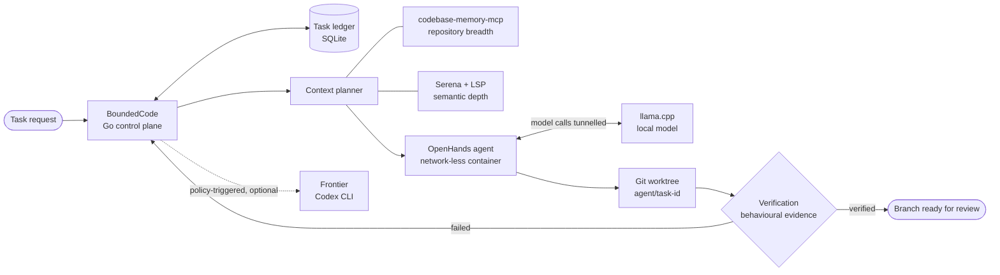

<div align="center">

# BoundedCode

**Bounded context. Bounded cost. Unbounded codebases.**

A local-first AI software-engineering platform for long-running work on large
repositories, with bounded context, deterministic verification, persistent
task state and optional frontier escalation.

[](https://github.com/akynte/boundedcode/actions/workflows/ci.yml)
[](https://github.com/akynte/boundedcode/actions/workflows/secrets.yml)
[](https://github.com/akynte/boundedcode/actions/workflows/dco.yml)
[](https://github.com/akynte/boundedcode/releases)
[](docs/releases/v0.1.0-alpha.1.md)
[](LICENSE)
[](go.mod)

[Quick start](#quick-start) ·
[How it works](#how-it-works) ·
[Validation](#validation) ·
[Verification](#verification) ·
[Security](#security) ·
[Limitations](#known-limitations) ·
[Docs](docs/)

</div>

> [!IMPORTANT]
> **Public Alpha.** BoundedCode is usable and has been validated
> experimentally on a small independent sample of real software-engineering
> tasks. It has been tested on one machine with one model. Commands,
> configuration and APIs may change, and it is not production-ready. Issue
> reports, compatibility reports and contributions are welcome.

## Why BoundedCode

Coding agents working on large codebases tend to fail in two ways:

- **They overflow context.** Pouring the repository into the prompt exceeds
  what a local model can hold and drives up frontier cost.
- **They mistake green tests for done.** An agent reports success because the
  tests pass, even when no test exercises the change.

BoundedCode is built around the opposite defaults:

| | |
|---|---|
| **Bounded context** | The model sees a small task-specific pack (typically a few thousand tokens) drawn from repository intelligence, not the repository. |
| **Local-first** | Inference runs on your machine through llama.cpp. A frontier model is an optional, policy-triggered exception. |
| **Proof, not just green tests** | A task is `TASK_VERIFIED` only when a test it adds fails on the base commit and passes with the change. |
| **Durable tasks** | A persistent ledger lets long tasks resume after Ctrl-C, a crash or a reboot. |
| **Contained agent** | The agent runs in a network-less container on its own git worktree. Nothing is pushed or merged for you. |

## Validation

| Stage | Result | Report |
|---|---|---|
| Initial validation: 8 real public tasks, frozen build | **0/8**, then **1/8** after the first defect fixes | [report](docs/benchmarks/small-real-world-validation-2026-10.md) |
| Engineering: the failures used as a development corpus (not a benchmark) | fixes to verification, agent tooling, resource handling, retrieval and execution control | [failure-driven](docs/benchmarks/failure-driven-engineering-2026-10.md) · [targeted](docs/benchmarks/targeted-engineering-pass-2026-10.md) |
| **Second independent validation:** 6 unseen, pre-screened tasks, run once | **5/6** strict `TASK_VERIFIED` · **6/6** hidden acceptance · **5/5** successes local-only · **0** false verification passes | [report](docs/benchmarks/second-independent-validation-2026-10.md) |

In a fresh small validation on 6 previously unseen public engineering tasks
whose hidden acceptance criteria were screened for consistency with the issue
before execution, BoundedCode completed 5/6 successfully, with 5/6 completed
using only the local model.

The tasks were selected before execution from SWE-bench Multilingual and
Multi-SWE-bench. They cover Go, JavaScript, TypeScript, an infrastructure
tool and a 1.8 M-token repository; on that repository the model saw 1.6 % of
the source. Screening rejected 10 of 24 candidates whose hidden tests could
not be derived from their issue. No frontier call was made, and there was no
human code intervention.

<details>
<summary><b>Why 5/6 and not 6/6?</b></summary>

<br>

The sixth task (Prometheus) was implemented correctly, and its hidden
acceptance test passed. BoundedCode still classified it **UNVERIFIED**: its
evidence checker did not associate the modified data-driven test file
(`promql/testdata/functions.test`) with the Go test function that reads it.
The official score stays **5/6**; hidden-acceptance correctness was **6/6**.
A verifier that withholds "verified" when it cannot prove the change is
behaving as intended.

</details>

> This is a small practical validation sample, not a statistically
> comprehensive benchmark.

## How it works


```mermaid
flowchart LR
    U([Task request]) --> CP[BoundedCode<br/>Go control plane]
    CP <--> L[(Task ledger<br/>SQLite)]
    CP --> P[Context planner]
    P --- CM[codebase-memory-mcp<br/>repository breadth]
    P --- SE[Serena + LSP<br/>semantic depth]
    P --> A[OpenHands agent<br/>network-less container]
    A <-->|model calls tunnelled| M[llama.cpp<br/>local model]
    A --> W[Git worktree<br/>agent/task-id]
    W --> V{Verification<br/>behavioural evidence}
    V -->|verified| R([Branch ready for review])
    V -->|failed| CP
    CP -.->|policy-triggered, optional| F[Frontier<br/>Codex CLI]
```

| Layer | Role |
|---|---|
| **Go control plane** | Orchestrates tasks, budgets, retries and escalation policy |
| **codebase-memory-mcp** | Repository breadth: code graph, impact, search |
| **Serena / LSP** (optional) | Semantic depth: definitions, references, implementations |
| **Context planner** | Builds small task-specific packs |
| **OpenHands SDK** | Agent runtime, in a sandboxed container |
| **llama.cpp + local model** | Reasoning and editing |
| **Verification engine** | Build, lint, tests and behavioural evidence |
| **Task ledger** | Persistent state and audit log; resume anywhere |
| **Frontier gate** | Optional escalation when the policy triggers |

More detail:
[system architecture](docs/architecture/system-architecture.md) ·
[product spec](docs/product-spec.md) ·
[implementation status](docs/development/status.md) ·
[ADRs](docs/architecture/adr/)

## Quick start

**Prerequisites:**
- Linux x86-64
- an NVIDIA GPU
- Go (see `go.mod`)
- Git, ripgrep and Docker
- the CUDA toolkit, to build llama.cpp
- `uv`, only for Serena

The [getting-started guide](docs/usage/getting-started.md) lists tested
versions.

```bash
git clone https://github.com/akynte/boundedcode.git
cd boundedcode
make build                                  # ./bin/boundedcode
./scripts/install-deps.sh ~/.local/bin      # gitleaks + codebase-memory-mcp (checksum-pinned)
./scripts/build-llama-cpp.sh                # pinned llama.cpp v0.5.0 with CUDA

# Download a model yourself (see "Models"), pinned to a commit and checksum-verified:
./scripts/fetch-model.sh unsloth/Qwen3.6-35B-A3B-GGUF Qwen3.6-35B-A3B-UD-Q4_K_M.gguf \
    a483e9e6cbd595906af30beda3187c2663a1118c ~/models

L=~/.local/share/boundedcode/runtimes/llama.cpp/v0.5.0/bin
./bin/boundedcode init --models-dir ~/models \
    --llama-server $L/llama-server --llama-bench $L/llama-bench \
    --adapter-dir $PWD/adapters/openhands/python
./bin/boundedcode sandbox build --dir adapters/openhands   # agent sandbox image
./bin/boundedcode doctor                                   # checks everything above
```

Run your first task:

```bash
./bin/boundedcode workspace create demo
./bin/boundedcode workspace add ~/src/my-service
./bin/boundedcode index
./bin/boundedcode task create "Return 404 instead of 500 for unknown users" \
    -c "go test ./... passes" --run
./bin/boundedcode task diff <id>        # review the agent/<id> branch like a pull request
./bin/boundedcode task resume <id>      # after Ctrl-C, a crash or a reboot
```

> [!TIP]
> Already running an OpenAI-compatible server? Use
> `init --external-url http://127.0.0.1:8080` instead of the llama.cpp flags.
> Run `boundedcode doctor` whenever something fails: it reports missing
> dependencies with an install hint.

This exact path was tested from a clean clone with an empty home directory
([record](benchmarks/reports/publication-20261005/fresh-clone-test.md)).

## Models

Model weights are **not** distributed with this project. You download them
from their publisher and are responsible for complying with each model's
license.

- **Profiles:** each file in [`configs/models/`](configs/models) pins the
  upstream source and revision, the file, the license and the llama.cpp
  settings.
- **Download:** `scripts/fetch-model.sh` checks the download against the
  sha256 the hub publishes for that revision.
- **Tooling:** `boundedcode model` inspects the profiles;
  `boundedcode bench infra --apply` tunes one for your machine.

| | |
|---|---|
| **Validated configuration** | Qwen3.6-35B-A3B, UD-Q4_K_M (Apache-2.0) on llama.cpp v0.5.0 |
| **Other profiles** | Present, but not part of the validation |

## Frontier escalation (optional)

BoundedCode runs **fully local without any frontier account**. Escalation is
off by default. If you enable it:

```text
local model first ──> escalation policy (Z1-Z4) ──> frontier only when the policy triggers
```

The policy triggers on repeated failures, rejected strategies, architectural
risk or a high-risk review.

- **Routes:** the Codex CLI with a ChatGPT subscription sign-in, or a manual
  mode that writes the packet to disk for you to answer.
- **No API keys:** they are refused.
- **Packets:** sanitized (host paths, secrets), and each one needs approval
  unless pre-approved.

In the second validation, no escalation was triggered. See
[ADR-0009](docs/architecture/adr/0009-frontier-escalation.md).

## Verification

| State | Meaning |
|---|---|
| **builds** | It compiles and lints. |
| **`tests_green`** | The repository's checks pass. Not enough on its own: in the initial validation, patches that changed nothing passed existing tests. |
| **`TASK_VERIFIED`** | Checks pass **and** there is behavioural evidence: a test the change adds or modifies **fails on the base commit and passes with the change**. |

- **Missing evidence:** the agent is asked once for a reproduction test.
  Without one, the task ends `tests_green` (UNVERIFIED) and is never presented
  as a verified merge candidate.
- **Gate integrity:** the verification config is read from the base commit,
  so the agent cannot weaken its own gate.

This is not formal verification. Known limits:
- data-driven test files read by a test elsewhere are not attributed;
- a test that does not compile on the base counts as failing there;
- a test can only prove the reading of a request that the agent chose.

## Security

The agent is treated as potentially wrong or adversarially steered, for
example by prompt injection in repository content.

| Control | Mechanism |
|---|---|
| Sandbox | Agent tools run in a container with no network. Only the task worktree is writable; there is no host home, SSH agent or credentials. |
| Secrets | `.env*`, keys, cloud credentials and kubeconfigs are masked in the sandbox and denied by path policy. |
| Protected paths | Changes to `.boundedcode/`, CI workflows or CODEOWNERS fail verification. |
| Git integrity | Worktree pointers, admin dirs and `HEAD` are verified before host git touches them. Nothing is pushed. |
| Command policy | A deterministic policy blocks push, destructive and deploy commands in verification. |
| Host reads | Context building never follows symlinks out of a worktree. |
| Frontier | Packets are sanitized, and the gate fails closed. |

> [!WARNING]
> A container is not a perfect boundary. Running an autonomous coding agent
> on untrusted repositories still carries risk. Never run BoundedCode where
> production credentials are reachable. See [SECURITY.md](SECURITY.md) and the
> [sandbox design and residual risks](docs/design/sandbox.md).

## Known limitations

1. **Small validation sample.** 8 + 6 public tasks, each run once. The second
   set was screened for issue-derivable tests; real requests are not.
2. **One machine and one model.** Other GPUs, platforms and models are
   untested.
3. **Ambiguity detection is imperfect.** The task contract is derived by the
   local model. It has flagged a clear request as ambiguous and misnamed real
   alternatives. With the default `task.ambiguity: ask`, a false positive
   costs a clarification question.
4. **Behavioural evidence misses some test layouts.** These include
   data-driven test files consumed by a test elsewhere.
5. **Frontier escalation was enabled but not exercised** in the second
   validation.
6. **The strategy governor** bounded runaway generation in development runs,
   but did not trigger during the independent validation.

<details>
<summary>Smaller limitations</summary>

<br>

- CLI only; there is no daemon or GUI.
- Verification presets cover Go and JavaScript/TypeScript. Other languages
  need a `.boundedcode/verification.yaml`.
- Cross-service analysis does not cover gRPC, OpenAPI, protobuf or SQL
  contracts.
- Some run-time errors for missing dependencies (Docker unreachable,
  codebase-memory-mcp missing) point to a log rather than giving an install
  hint. `doctor` reports both clearly.

</details>

## Reference hardware

**Tested configuration, not a minimum requirement:**

| | |
|---|---|
| Machine | Lenovo LOQ 15IRH8 laptop |
| CPU | Intel Core i7-13620H |
| GPU | NVIDIA RTX 4060 Laptop, 8 GB VRAM |
| RAM | 64 GB DDR5 |
| OS | Debian 13 |
| Model | Qwen3.6-35B-A3B, UD-Q4_K_M, 131 K context, MoE experts partly on CPU |

During validation the model server used up to 29.3 GiB of RAM, and
BoundedCode itself under 70 MiB. No minimum requirement has been measured.
Smaller machines may work with smaller models or contexts, but this is
untested.

Earlier development benchmarks (decode speed, an 11-task synthetic suite,
kill/resume and cross-service ablations) are in
[benchmarks/reports/](benchmarks/reports/) and the
[model evaluation](docs/design/model-evaluation.md).

## Contributing

Bug reports, model compatibility reports and pull requests are welcome.

- [CONTRIBUTING.md](CONTRIBUTING.md): development setup, tests, and the
  DCO sign-off on every commit (`git commit -s`).
- [SECURITY.md](SECURITY.md): report vulnerabilities privately, not in issues.
- [CODE_OF_CONDUCT.md](CODE_OF_CONDUCT.md) and [GOVERNANCE.md](GOVERNANCE.md).

## License

Licensed under [Apache-2.0](LICENSE) (see also [NOTICE](NOTICE)).
Third-party components and their licenses are listed in
[THIRD_PARTY_NOTICES.md](THIRD_PARTY_NOTICES.md) and the
[upstream license matrix](docs/licensing/upstream-license-matrix.md).

BoundedCode is independent and is not affiliated with, sponsored by, or
endorsed by the upstream projects or vendors it integrates with.
