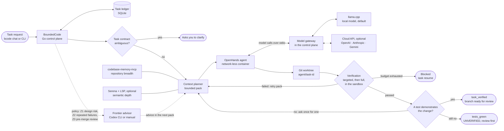

<div align="center">

# BoundedCode

**Bounded context. Bounded cost. Unbounded codebases.**

An AI software-engineering platform for long-running work on large
repositories, with bounded context, deterministic verification, persistent
task state and optional frontier escalation. It runs a local model by default,
or a cloud model API you choose.

[](https://github.com/akynte/boundedcode/actions/workflows/ci.yml)
[](https://github.com/akynte/boundedcode/actions/workflows/secrets.yml)
[](https://github.com/akynte/boundedcode/actions/workflows/dco.yml)
[](https://github.com/akynte/boundedcode/releases)
[](docs/releases/v0.1.0-alpha.2.md)
[](LICENSE)
[](go.mod)

[Quick start](#quick-start) ·
[How it works](#how-it-works) ·
[Validation](#validation) ·
[Verification](#verification) ·
[Security](#security) ·
[Limitations](#known-limitations) ·
[Docs](docs/)

</div>

> [!IMPORTANT]
> **Public Alpha.** BoundedCode is usable and has been validated on a small
> held-out sample of real software-engineering tasks (tasks not used during
> development and never shown to the agent). It has been tested on one
> machine with one model. Commands, configuration and APIs may change, and it
> is not production-ready. Issue reports, compatibility reports and
> contributions are welcome.

## Why BoundedCode

Coding agents working on large codebases tend to fail in two ways:

- **They overflow context.** Pouring the repository into the prompt exceeds
  what a local model can hold and drives up frontier cost.
- **They mistake green tests for done.** An agent reports success because the
  tests pass, even when no test exercises the change.

BoundedCode is built around the opposite defaults:

| Principle | What it means |
|---|---|
| **Bounded context** | The model starts from a small task-specific pack drawn from repository intelligence and reads further code through tools as needed, instead of receiving the whole repository. |
| **Local by default** | Inference runs on your machine through llama.cpp unless you choose a cloud model API (OpenAI, Anthropic, Gemini or an OpenAI-compatible service; unvalidated, see [Cloud models](#cloud-models)). A frontier model is an optional, policy-triggered exception: enabled but not triggered in the second validation; in the first validation 4 frontier calls were sent and no task was accepted. |
| **Evidence, not just green tests** | A task is `TASK_VERIFIED` only when a test it adds fails on the base commit and passes with the change (fail-before/pass-after evidence, not proof of correctness). |
| **Durable tasks** | A persistent ledger lets long tasks resume after Ctrl-C, a crash or a reboot. |
| **Contained agent** | The agent runs in a network-less container on its own git worktree. Nothing is pushed or merged for you. |

## Validation

| Stage | Result | Report |
|---|---|---|
| Initial validation: 8 real public tasks, frozen build | **0/8**, then **1/8** after the first defect fixes | [report](docs/benchmarks/small-real-world-validation-2026-10.md) |
| Engineering: the failures used as a development corpus (development evidence, not a validation) | fixes to verification, agent tooling, resource handling, retrieval and execution control | [failure-driven](docs/benchmarks/failure-driven-engineering-2026-10.md) · [targeted](docs/benchmarks/targeted-engineering-pass-2026-10.md) |
| **Second validation (held out):** 6 tasks not used during development and never shown to the agent, screened for issue-derivable acceptance tests, run once | **5 of 6** strict `TASK_VERIFIED` and passing the datasets' hidden acceptance tests (hidden from the agent) · **6 of 6** hidden tests pass · all **5** successes local-only: no frontier calls (escalation enabled, not triggered) · **0** false verification passes among the 5 `TASK_VERIFIED` tasks | [report](docs/benchmarks/second-independent-validation-2026-10.md) |

In a fresh small validation on 6 public engineering tasks not used during
development and never shown to the agent, whose hidden acceptance criteria
were screened for consistency with the issue before execution, 5 of the 6
tasks succeeded, and all 5 successes used only the local model; no task made
a frontier call.

The tasks were selected before execution from the SWE-bench Multilingual and
Multi-SWE-bench benchmark datasets. They cover Go, JavaScript, TypeScript, an
infrastructure tool and a repository of 1.8 M estimated source tokens.
Screening rejected 10 of 24 candidates whose hidden tests could not be
derived from their issue. There was no human code intervention.

Context use was roughly 18–35 K tokens per task across repositories of
0.12–1.83 M estimated source tokens, so the share of the repository that
entered context depends on repository size: at most about 1.6 % on the
largest repository, 29.1 % on the smallest (gin). These figures include all
tool output (files read, search and test output) and are therefore upper
bounds; source tokens are estimated as bytes × 10/32.

The 0 false verification passes covers the 5 `TASK_VERIFIED` tasks, on a task
set screened for issue-derivable tests. In development runs with the same
gate design, tasks were `TASK_VERIFIED` but failed hidden tests: 3 in the
final failure-driven run, where the issue allowed another reading or the
hidden test required details the issue did not state
([§C](docs/benchmarks/failure-driven-engineering-2026-10.md#c-verification-why-false-passes-happened-what-prevents-them-now)),
and 2 in the targeted pass's development checks, one on another valid reading
and one whose only evidence was a test that does not compile on the base
([verification honesty](docs/benchmarks/targeted-engineering-pass-2026-10.md#verification-honesty-in-the-development-checks)).

<details>
<summary><b>Why 5/6 and not 6/6?</b></summary>

<br>

The sixth task (Prometheus) was implemented so that its hidden acceptance
test passed. BoundedCode still classified it **UNVERIFIED**: its
evidence checker did not associate the modified data-driven test file
(`promql/testdata/functions.test`) with the Go test function that reads it.
The official score stays **5 of 6**; 6 of 6 hidden acceptance tests passed.
A verifier that withholds `TASK_VERIFIED` when it cannot show fail-before/
pass-after evidence is behaving as intended. After this validation, the
checker was changed to attribute changed test data to the Go package whose
tests read it (unreleased; covered by unit tests, not yet re-validated).

</details>

> This is a small practical validation sample, not a statistically
> comprehensive evaluation.

### Why the two validations are not an improvement curve

The second set was screened for acceptance tests derivable from the issue;
the first set was screened for environment validity only, and three of its
tasks failed on identifiers that only the reference solution introduces. The
first set also had a "difficult" slot (a multi-file reference patch); the
second did not. The second validation ran with `task.ambiguity: proceed`, not
the default `ask`. On the development tasks, the candidate build's checks
before the freeze passed 0 of 2 (0 of 3 runs), per the
[targeted engineering pass](docs/benchmarks/targeted-engineering-pass-2026-10.md#development-regression-result).
Therefore 0/8 → 5/6 does not measure system improvement; each result stands
on its own, with its own scope.

## How it works


```mermaid
flowchart LR
    U([Task request<br/>bcode chat or CLI]) --> CP[BoundedCode<br/>Go control plane]
    CP <--> L[(Task ledger<br/>SQLite)]
    CP --> C{Task contract:<br/>ambiguous?}
    C -->|yes| Q([Asks you to clarify])
    C -->|no| P[Context planner<br/>bounded pack]
    CM[codebase-memory-mcp<br/>repository breadth] --- P
    SE[Serena + LSP, optional<br/>semantic depth] --- P
    P --> A[OpenHands agent<br/>network-less container]
    A <-->|model calls over stdio| G[Model gateway<br/>in the control plane]
    G <--> M[llama.cpp<br/>local model, default]
    G <-.-> K[Cloud API, optional<br/>OpenAI · Anthropic · Gemini]
    A --> W[Git worktree<br/>agent/task-id]
    W --> V{Verification<br/>targeted, then full,<br/>in the sandbox}
    V -->|failed: retry pack| P
    V -->|budget exhausted| B([Blocked<br/>task resume])
    V -->|passed| E{A test demonstrates<br/>the change?}
    E -->|no: ask once for one| P
    E -->|yes| R([task_verified<br/>branch ready for review])
    E -->|still no| R2([tests_green<br/>UNVERIFIED, review first])
    CP -.->|policy: Z1 design risk,<br/>Z2 repeated failures,<br/>Z3 pre-merge review| F[Frontier advisor<br/>Codex CLI or manual]
    F -.->|advice in the next pack| P
```

Each attempt gets a bounded context pack; the agent has only terminal,
file-edit and task-tracker tools, and its model calls go back over stdio to
the gateway, so the container needs no network. Before verification the
control plane checks the worktree's integrity and commits a checkpoint. A
passing change that touches a cross-service contract without updating the
other side gets one more round to check it, and frontier escalation also
runs when you ask for it (Z4). A task that runs out of attempts, tokens or
time is blocked, not failed: `task resume` continues it.

| Layer | Role |
|---|---|
| **`bcode` chat / CLI** | Interactive chat and views (experimental) or plain commands, over the same operations |
| **Go control plane** | Orchestrates tasks, budgets, retries and escalation policy |
| **codebase-memory-mcp** | Repository breadth: code graph, impact, search |
| **Serena / LSP** (optional) | Semantic depth: definitions, references, implementations |
| **Context planner** | Builds small task-specific packs |
| **OpenHands SDK** | Agent runtime, in a sandboxed container |
| **Model gateway** | Carries the agent's model calls to the local model or a cloud API; metering, budgets, API keys |
| **llama.cpp + local model**, or a cloud API | Reasoning and editing (local by default) |
| **Verification engine** | Build, lint and tests in the sandbox, a secret scan of the diff on the host, and behavioural evidence |
| **Task ledger** | Persistent state and audit log; resume anywhere |
| **Frontier gate** | Optional escalation when the policy triggers or you ask; advice goes into the next pack |

### What BoundedCode implements vs. what it integrates

BoundedCode is the control plane around existing tools. The model, the agent
loop, code indexing and language servers come from upstream projects, used
unmodified as separate processes or pinned dependencies (no forks, no
vendored source).

**Implemented in this repository** (Go, plus a small Python adapter):

| Component | Where |
|---|---|
| Task orchestration: attempts, retries, budgets, resume after a crash | `internal/orchestrator`, `internal/task` |
| Task ledger and audit log (SQLite) | `internal/store`, `internal/telemetry` |
| Context planner and ranked retrieval seeds | `internal/contextplan` |
| Strategy governor (runaway control) and task contract (ambiguity handling) | `internal/orchestrator`, `internal/task` |
| Verification engine and behavioural-evidence gate | `internal/verify` |
| Sandbox setup, secret masking, command and path policy | `internal/sandbox`, `internal/policy` |
| Git worktree management and tamper checks | `internal/gitops` |
| Cross-service contract analysis (HTTP, topics, env, Terraform) | `internal/xservice` |
| Model gateway (metering, tunnelled agent calls) and llama.cpp supervision | `internal/inference` |
| Frontier escalation policy, packet building and sanitization | `internal/frontier` |
| Process management for codebase-memory-mcp and Serena | `internal/repointel` |
| Terminal interface and chat; guided set-up; applying results to a checkout | `internal/tui`, `internal/cli` |
| OpenHands adapter: JSON-RPC bridge to the agent SDK | `adapters/openhands/python` |
| CLI, `doctor`, benchmark harness | `internal/cli`, `internal/benchmark` |

**Integrated from upstream** (pinned; licenses in
[THIRD_PARTY_NOTICES.md](THIRD_PARTY_NOTICES.md)):

| Component | Role | How it is used |
|---|---|---|
| [llama.cpp](https://github.com/ggml-org/llama.cpp) v0.5.0 | Local inference | External `llama-server` process |
| Local model (validated: Qwen3.6-35B-A3B) | Reasoning and editing | Weights downloaded by you; not redistributed |
| [OpenHands Software Agent SDK](https://github.com/OpenHands/software-agent-sdk) 1.51.0 | Agent loop and tools | Python dependency of the adapter, inside the sandbox container |
| [codebase-memory-mcp](https://github.com/DeusData/codebase-memory-mcp) v0.11.0 | Code graph, impact, search | External binary |
| [Serena](https://github.com/oraios/serena) v1.7.0 (optional) | LSP-backed symbol navigation | External MCP processes, one per task worktree |
| Language servers (`gopls`, `typescript-language-server`) | Used by Serena | Installed by you |
| [gitleaks](https://github.com/gitleaks/gitleaks) v8.30.1 | Secret scanning of task diffs | External binary |
| Docker (or Podman) | Container sandbox | Container engine |
| [Codex CLI](https://github.com/openai/codex) (optional) | Frontier escalation | External `codex exec` process, run in its own container |
| Go libraries: cobra, yaml, modernc.org/sqlite | CLI, config, embedded database | Go module dependencies |

Version pins and update policy:
[upstream components](docs/architecture/upstream-components.md).

More detail:
[system architecture](docs/architecture/system-architecture.md) ·
[product spec](docs/product-spec.md) ·
[implementation status](docs/development/status.md) ·
[ADRs](docs/architecture/adr/)

## Quick start

### Install and run (one command)

Linux and macOS:

```bash
curl -fsSL https://raw.githubusercontent.com/akynte/boundedcode/main/scripts/install.sh | bash
cd ~/src/my-service     # any git repository
bcode
```

Windows (PowerShell):

```powershell
irm https://raw.githubusercontent.com/akynte/boundedcode/main/scripts/install.ps1 | iex
cd $HOME\src\my-service
bcode
```

`install.sh` puts `boundedcode` and its short name `bcode` in `~/.local/bin`.
It uses a checksum-verified release binary when the release ships one, and
otherwise builds from source with Go. `install.ps1` installs the
checksum-verified release binary into
`%LOCALAPPDATA%\Programs\BoundedCode\bin` and adds it to your user PATH.
Release binaries for macOS and Windows ship from the next release on; until
then, build from source there. `bcode` opens a chat for the repository
you are in. On the first run it checks the prerequisites and offers to install
what is missing: tools, llama.cpp, the model weights and the Docker sandbox.
It asks before every download or build. After that, describe a change and it
runs as a task. See [the terminal interface](docs/usage/tui.md).

You need git and a container engine (Docker, Podman, or Docker Desktop on
macOS and Windows). For local inference, set-up recommends a model that fits
this machine's memory and GPU (NVIDIA with CUDA, Apple Silicon with Metal,
or CPU only), and downloads a prebuilt llama.cpp where it does not build one
(it builds from source on Linux when a compiler and CMake are present).
Without a capable machine, choose a cloud model API instead. `bcode setup
--check` shows what is missing from the shell. Linux is the validated
platform; macOS and Windows are experimental (see
[Known limitations](#known-limitations) and the
[platform table](docs/usage/getting-started.md#platforms)).

### Manual install

This is the Linux path with a CUDA build of llama.cpp, as on the reference
machine. On macOS and Windows, build the CLI with `go build` and let
`bcode setup` install the rest (it downloads the pinned prebuilt tools).

**Prerequisites:**
- Linux (x86-64 or arm64)
- Go (see `go.mod`)
- Git, ripgrep and Docker
- for GPU inference, an NVIDIA GPU and the CUDA toolkit, to build llama.cpp
- `uv`, only for Serena

The [getting-started guide](docs/usage/getting-started.md) lists tested
versions.

```bash
git clone https://github.com/akynte/boundedcode.git
cd boundedcode
make build                                  # ./bin/boundedcode
./scripts/install-deps.sh ~/.local/bin      # gitleaks + codebase-memory-mcp (checksum-pinned)
./scripts/build-llama-cpp.sh                # pinned llama.cpp v0.5.0 with CUDA

# Download a model (see "Models"), pinned to a commit and sha256-verified:
./bin/boundedcode model recommend               # the model that suits this machine
./bin/boundedcode model fetch qwen3.6-35b-a3b   # into ~/.local/share/boundedcode/models

L=~/.local/share/boundedcode/runtimes/llama.cpp/v0.5.0/bin
./bin/boundedcode init \
    --llama-server $L/llama-server --llama-bench $L/llama-bench \
    --adapter-dir $PWD/adapters/openhands/python
./bin/boundedcode sandbox build --dir adapters/openhands   # agent sandbox image
./bin/boundedcode doctor                                   # checks everything above
```

Run your first task:

```bash
./bin/boundedcode workspace create demo
./bin/boundedcode workspace add ~/src/my-service
./bin/boundedcode index
./bin/boundedcode task create "Return 404 instead of 500 for unknown users" \
    -c "go test ./... passes" --run
./bin/boundedcode task diff <id>        # review the agent/<id> branch like a pull request
./bin/boundedcode task resume <id>      # after Ctrl-C, a crash or a reboot
```

Prefer a full-screen interface? `./bin/boundedcode tui` covers all of the above
and the rest of the CLI: live task activity, diffs, verification, workspaces,
repository intelligence, the runtime, frontier escalations, stats and
`doctor`. See [docs/usage/tui.md](docs/usage/tui.md).

> [!TIP]
> Already running an OpenAI-compatible server? Use
> `init --external-url http://127.0.0.1:8080` instead of the llama.cpp flags.
> Run `boundedcode doctor` whenever something fails: it reports missing
> dependencies with an install hint.

This exact path was tested from a clean clone with an empty home directory
([record](benchmarks/reports/publication-20261005/fresh-clone-test.md)).

## Models

Model weights are **not** distributed with this project. You download them
from their publisher and are responsible for complying with each model's
license.

- **Profiles:** each file in [`configs/models/`](configs/models) pins the
  upstream source and revision, the file, the license and the llama.cpp
  settings.
- **Choice:** `bcode model recommend` rates every profile against this
  machine's RAM and GPU (a rule of thumb, not a measurement) and proposes one;
  `bcode model list` shows them all. Only the default is validated; the others
  are marked experimental until they are benchmarked here.
- **Download:** `bcode model fetch NAME` downloads at the pinned commit,
  resumes interrupted downloads, and checks the file against the sha256 in its
  profile.
- **Tooling:** `bcode model use NAME` makes a model the default;
  `boundedcode bench infra --apply` tunes one for your machine.

| Model profiles | Status |
|---|---|
| **Validated configuration** | Qwen3.6-35B-A3B, UD-Q4_K_M (Apache-2.0) on llama.cpp v0.5.0 |
| **Other profiles** | Present, but not part of the validation |

## Cloud models

Instead of a local model, the agent can use a cloud model API:

```bash
bcode provider use anthropic --model claude-opus-5-5   # or openai, gemini, openai-compatible
bcode provider key set anthropic                        # prompts without echo
bcode provider test                                     # one short request
```

- **Keys** are stored in the OS credential store (Secret Service, macOS
  Keychain, Windows Credential Manager), or an owner-only file where none
  exists, never in the configuration file. Only the host-side gateway uses
  them; the agent's sandbox has no network and never sees a key.
- **Your code goes to the provider.** With a cloud provider, everything the
  agent reads (context packs, file contents, command and test output) is sent
  to that provider, under its data policy. Secrets are masked as with a local
  model, but repository code is not. Use the local model for code that must
  not leave the machine.
- **Cost** is per token. `bcode stats` shows usage per provider, and an
  estimate when you enter prices (`--input-price`, `--output-price`).
- **Status:** experimental. The translations are tested against the providers'
  documented request and response shapes with fake servers, not on real
  tasks; the validation results above are for the local model only.

See [ADR-0010](docs/architecture/adr/0010-cloud-model-providers.md) and the
[configuration reference](docs/usage/configuration.md#model-provider).

## Frontier escalation (optional)

BoundedCode runs **fully local without any frontier account**. Escalation is
off by default. If you enable it:

```text
local model first ──> escalation policy (Z1-Z4) ──> frontier only when the policy triggers
```

The policy triggers on repeated failures, rejected strategies, architectural
risk or a high-risk review.

- **Routes:** the Codex CLI with a ChatGPT subscription sign-in, or a manual
  mode that writes the packet to disk for you to answer.
- **No API keys for the frontier:** escalation uses only the Codex
  subscription sign-in (the agent's cloud provider is a separate setting).
- **Packets:** sanitized (host paths, secrets), and each one needs approval
  unless pre-approved.

Escalation was enabled but not triggered in the second validation. In the
first validation, 4 frontier calls were sent and no task was accepted
([report](docs/benchmarks/small-real-world-validation-2026-10.md#answers)).
See [ADR-0009](docs/architecture/adr/0009-frontier-escalation.md).

## Verification

| State | Meaning |
|---|---|
| **builds** | It compiles and lints. |
| **`tests_green`** | The repository's checks pass. Not enough on its own: in the initial validation, patches that changed nothing passed existing tests. |
| **`TASK_VERIFIED`** | Checks pass **and** there is behavioural evidence: a test the change adds or modifies (test code or test data) **fails on the base commit with the changed tests, does not fail there without them, and passes with the change**. |

- **Missing evidence:** the agent is asked once for a reproduction test.
  Without one, the task ends `tests_green` (UNVERIFIED) and is never presented
  as a verified merge candidate.
- **Gate integrity:** the verification config is read from the base commit,
  so the agent cannot change which stages run. It can still edit tests and
  build scripts in its worktree; only review catches an adversarial change
  there (see the sandbox's [residual risks](docs/design/sandbox.md#residual-risks-known-accepted-for-now)).

A changed test that does not compile or load on the base (it calls code the
change adds) shows that the API exists, not that it behaves as asked, so it is
not evidence; nor is a stage that times out on the base.

This is not formal verification. Known limits:
- Go failures are compared per test function; other languages per stage
  (the stage must fail with the changed tests and pass without them);
- a change that only adds new API needs a test that also runs on the
  original code, or it ends `tests_green`;
- a test can only demonstrate the reading of a request that the agent chose.

## Security

The agent is treated as potentially wrong or adversarially steered, for
example by prompt injection in repository content.

| Control | Mechanism |
|---|---|
| Sandbox | Agent tools run in a container with no network. Only the task worktree is writable; there is no host home, SSH agent or credentials. |
| Secrets | `.env*`, keys, cloud credentials and kubeconfigs are masked in the sandbox and denied by path policy. |
| Protected paths | Changes to `.boundedcode/`, CI workflows or CODEOWNERS fail verification. |
| Git integrity | Worktree pointers, admin dirs and `HEAD` are verified before host git touches them. Nothing is pushed. |
| Command policy | A deterministic policy blocks push, destructive and deploy commands in verification. |
| Host reads | Context building never follows symlinks out of a worktree. |
| Frontier | Packets are sanitized, and the gate fails closed. |

> [!WARNING]
> A container is not a perfect boundary. Running an autonomous coding agent
> on untrusted repositories still carries risk. Never run BoundedCode where
> production credentials are reachable. See [SECURITY.md](SECURITY.md) and the
> [sandbox design and residual risks](docs/design/sandbox.md).

## Known limitations

1. **Small validation sample.** 8 + 6 public tasks, each run once. The second
   set was screened for issue-derivable tests; real requests are not.
2. **Ambiguity detection is imperfect.** The task contract is derived by the
   local model. It has flagged a clear request as ambiguous and misnamed real
   alternatives. The second validation ran with `task.ambiguity: proceed`,
   not the default `ask`; under the default, one clear task (vue) would have
   stopped on a false ambiguity flag. Since then, a material ambiguity is
   checked against the request text before it can stop a task: a second
   local-model call quotes the request, and the ambiguity is dropped when a
   quote that settles it occurs in the request, or when fewer than two of
   its readings have a supporting quote there. This check, and the retry of
   a contract that names nothing required, have unit tests with scripted
   model replies only; they have not been run on real tasks.
3. **New models, cloud providers and platforms are unmeasured.** Only
   Qwen3.6-35B-A3B on the reference machine (Linux) is benchmarked. The other
   model profiles and the cloud providers work but their quality on
   BoundedCode tasks is unknown, and model fit is a rule of thumb. macOS and
   Windows build and vet in CI, but their unit tests do not pass there yet
   (at a8fce66: 5 of 31 test packages fail on macOS, 14 of 31 on Windows),
   and the full flow has not been run on a Mac or a Windows machine.
4. **Recent evidence-check changes are not yet validated.** Data-driven
   test files are now attributed to the Go package that reads them, and
   tests that only fail to compile on the base no longer count. Both changes are unreleased
   and covered by unit tests only; non-Go stages are compared per stage, not
   per test.
5. **Frontier escalation is unproven.** It was enabled but not triggered in
   the second validation; in the first, 4 frontier calls were sent and no
   task was accepted.
6. **The strategy governor** bounded runaway generation in development runs,
   but did not trigger during the held-out validation.
7. **No baseline advantage shown.** On the two-task baseline in the first
   validation, BoundedCode did not improve the same local model's result and
   was slower on those tasks; no baseline was run on the held-out set
   ([baseline comparison](benchmarks/reports/small-real-world-validation-20261004/baseline-comparison.md)).

<details>
<summary>Smaller limitations</summary>

<br>

- Terminal only (the CLI and the full-screen `bcode` interface); there is
  no daemon or GUI.
- Verification runs offline, so a project's dependencies must already be
  installed: in the checkout (`node_modules`, `.venv`, `vendor`) or in this
  machine's package caches (Go, Cargo, Maven, Gradle). Built-in presets
  cover Go, JavaScript/TypeScript, Python, Rust, Java (Maven, Gradle),
  C/C++ (CMake, Meson, Autotools, Make), Ruby and PHP without configuration;
  other languages run the Makefile's `test`/`check` target, or say that no
  test runner was found
  ([reference](docs/usage/configuration.md#built-in-presets)).
- Cross-service analysis does not cover gRPC, OpenAPI, protobuf or SQL
  contracts.

</details>

## How this was built

I designed the architecture, the threat model, the verification model and
the evaluation protocol, and made the release and scope decisions.
Implementation, test runs and first drafts of the reports were produced with
heavy use of AI coding agents, under that design and review. The validation
reports, errata and failures are published with their results unedited,
including results that did not support a release.

## Reference hardware

**Tested configuration, not a minimum requirement:**

| Component | Tested configuration |
|---|---|
| Machine | Lenovo LOQ 15IRH8 laptop |
| CPU | Intel Core i7-13620H |
| GPU | NVIDIA RTX 4060 Laptop, 8 GB VRAM |
| RAM | 64 GB DDR5 |
| OS | Debian 13 |
| Model | Qwen3.6-35B-A3B, UD-Q4_K_M, 131 K context, MoE experts partly on CPU |

During validation the model server used up to 29.3 GiB of RAM, and
BoundedCode itself under 70 MiB. No minimum requirement has been measured.
Smaller machines may work with smaller models or contexts, but this is
untested.

Earlier development benchmarks (decode speed, an 11-task synthetic suite,
kill/resume and cross-service ablations) are in
[benchmarks/reports/](benchmarks/reports/) and the
[model evaluation](docs/design/model-evaluation.md).

## Contributing

Bug reports, model compatibility reports and pull requests are welcome.

- [CONTRIBUTING.md](CONTRIBUTING.md): development setup, tests, and the
  DCO sign-off on every commit (`git commit -s`).
- [SECURITY.md](SECURITY.md): report vulnerabilities privately, not in issues.
- [CODE_OF_CONDUCT.md](CODE_OF_CONDUCT.md) and [GOVERNANCE.md](GOVERNANCE.md).

## License

Licensed under [Apache-2.0](LICENSE) (see also [NOTICE](NOTICE)).
Third-party components and their licenses are listed in
[THIRD_PARTY_NOTICES.md](THIRD_PARTY_NOTICES.md) and the
[upstream license matrix](docs/licensing/upstream-license-matrix.md).

BoundedCode is independent and is not affiliated with, sponsored by, or
endorsed by the upstream projects or vendors it integrates with.
