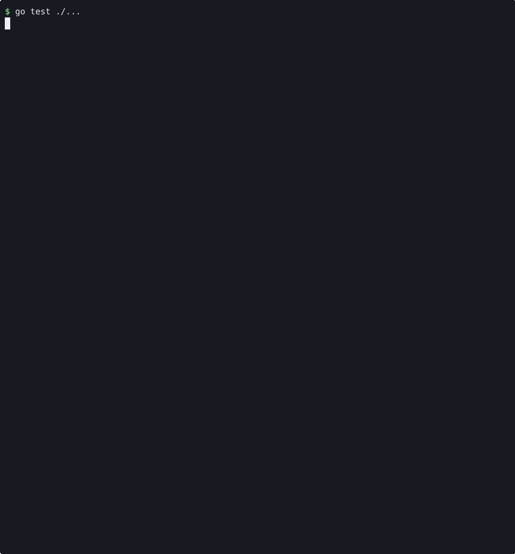
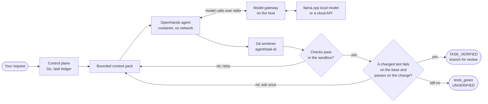

<div align="center">

# BoundedCode

**A control plane for AI coding agents that does not treat a green test run as proof.**

BoundedCode runs a coding agent on your repository inside a network-less
sandbox. It reports a change as verified only when a test that the change
adds fails on the original code and passes with the change. It uses a local
model through llama.cpp by default, or a cloud model API you choose.

[](https://github.com/akynte/boundedcode/actions/workflows/ci.yml)
[](https://github.com/akynte/boundedcode/releases)
[](LICENSE)

[Problem](#the-problem-green-tests-are-weak-evidence) ·
[What it does](#what-boundedcode-does) ·
[Demo](#demo) ·
[Quick start](#quick-start) ·
[Results](#results) ·
[How it works](#how-it-works) ·
[Limitations](#known-limitations) ·
[Docs](docs/README.md)

</div>

> [!IMPORTANT]
> **Public alpha.** BoundedCode has been validated on one Linux machine with
> one local model, on 14 public tasks (6 of them held out). macOS, Windows,
> cloud providers and other models are experimental. Commands and
> configuration may change, and it is not production-ready.

## The problem: green tests are weak evidence

Coding agents usually stop when the build and the tests pass. On real
repositories, that often proves little:

- The existing tests may never exercise the behaviour the request is
  about. In the [demo](#demo), `go test ./...` passes on the buggy code
  before any change is made.
- In BoundedCode's own first validation, with an earlier gate that accepted
  green checks:
  - patches that changed nothing passed the existing tests;
  - 4 of 8 frozen runs passed the repository's checks but failed the
    dataset's hidden acceptance tests
    ([report](docs/benchmarks/small-real-world-validation-2026-10.md#model-and-task-failures)).

A test run that would also have passed without the change does not show
that the change did anything.

## What BoundedCode does

BoundedCode does not implement a new agent loop. It wraps an existing one
(the [OpenHands Software Agent SDK](https://github.com/OpenHands/software-agent-sdk))
in a control plane, written in Go, that decides what the agent sees, where
it runs, and when its work counts as done.

1. **Bounded context.** The agent starts from a small task-specific context
   pack built from repository intelligence: roughly 18–35 K tokens per task
   in the held-out validation. It reads further code through tools as
   needed.
2. **Sandboxed execution.** The agent works in its own git worktree, inside
   a container with no network. Its model calls go over stdio to a gateway
   on the host, so neither API keys nor the network enter the sandbox.
3. **Deterministic checks.** Build, lint and tests run in the sandbox, with
   the stages read from the base commit, so the agent cannot change which
   ones run. A secret scan and a protected-path check run on the diff.
4. **Behavioural evidence.** A test that the change adds or modifies must
   fail on the base commit, must not fail there without the change's tests
   (a control run), and must pass with the change. If no test does, the
   agent is asked once for one. Without it, the task ends `tests_green`
   (UNVERIFIED), never as a verified merge candidate.
5. **Durable tasks.** Task state and an audit log are kept in a SQLite
   ledger. A task resumes after Ctrl-C, a crash or a reboot. Running out of attempts,
   tokens or time blocks a task; it does not fail it.
6. **Review, not merge.** The result is a branch, `agent/<task-id>`.
   Nothing is pushed or merged for you.

| Result | Meaning |
|---|---|
| `tests_green` | The repository's checks pass, but no test shows the change. Review it first. |
| `TASK_VERIFIED` | The checks pass, and a test the change adds fails on the base and passes with the change. |

`TASK_VERIFIED` is evidence that a test captures a change in behaviour. It
is not formal verification and does not guarantee the change is correct:
the agent chooses which reading of the request its test checks. See
[Verification](#verification).

## Demo



A real run with the local Qwen3.6-35B-A3B on an RTX 4060 laptop; the
recording shortens the waits. An excerpt of the terminal output:

```text
$ go test ./...
ok      example.com/shop        0.001s

$ bcode task create --run "Orders of exactly 10 items do not get the 10% bulk discount:
  Total([]Item{{PriceCents: 100, Qty: 10}}) returns 1000 but should be 900."
08:22:15 attempt 1/6: sending initial context pack (499 tokens)
08:23:14 verify full shop: passed=true (2.33s)
08:23:14 verification passed but the change adds or modifies no tests; asking the agent for a test that demonstrates the change
08:23:16 attempt 2/6: sending retry context pack (999 tokens)
08:23:46 verify full shop: passed=true (2.354s)
08:23:48 task t20261008-c8c85e is a verified merge candidate on agent/t20261008-c8c85e
task t20261008-c8c85e: status=completed phase=review verification=task_verified attempts=2 tokens=13348 escalations=0 (1m43s)
```

After the first attempt every check passed, but the change added no test,
so BoundedCode asked for one. The second attempt added
`TestTotalBulkDiscountExactly10`, which fails on the original code. The
final diff (`bcode task diff`) shows the fix (`count > 10` becomes
`count >= 10`) and the new test.

## Quick start

Linux and macOS:

```bash
curl -fsSL https://raw.githubusercontent.com/akynte/boundedcode/main/scripts/install.sh | bash
cd ~/src/my-service     # any git repository
bcode
```

Windows (PowerShell):

```powershell
irm https://raw.githubusercontent.com/akynte/boundedcode/main/scripts/install.ps1 | iex
cd $HOME\src\my-service
bcode
```

The installers download a checksum-verified release binary:

- `install.sh` installs `boundedcode` and its short name `bcode` into
  `~/.local/bin`. It builds from source with Go when no release has a
  binary for your platform.
- `install.ps1` installs into `%LOCALAPPDATA%\Programs\BoundedCode\bin` and
  adds that folder to your PATH.

On the first run, `bcode` checks the prerequisites and offers to install
what is missing: tools, llama.cpp, model weights and the sandbox image. It
asks before every download or build. After that, describe a change in the
chat and it runs as a task. `bcode setup --check` lists what is missing from
the shell.

**What you need:**
- git and a container engine: Docker, Podman, or Docker Desktop on macOS
  and Windows.
- For the default local model, a machine like the reference one: an NVIDIA
  GPU with 8 GB and 32–64 GB of RAM. `bcode model recommend` suggests a
  model that fits yours.
- Or a cloud model API instead.
- The project's dependencies installed, in the checkout or in the package
  caches: verification runs offline.

| Platform | Status |
|---|---|
| Linux (x86-64) | Validated on the reference machine |
| Linux (arm64) | Builds; not run |
| macOS (Apple Silicon, Intel) | Experimental: release binaries exist, but the full flow has not been run on a Mac |
| Windows (x64) | Experimental: release binaries exist, but the full flow has not been run on Windows |

More:
- [Getting started](docs/usage/getting-started.md): the manual install,
  workspaces, multi-repository tasks and the plain CLI.
- [Terminal interface](docs/usage/tui.md): the chat and its views.
- The manual Linux path was tested from a clean clone with an empty home
  directory ([record](benchmarks/reports/publication-20261005/fresh-clone-test.md)).

## Results

| Stage | Result | Report |
|---|---|---|
| Initial validation: 8 public tasks, screened for environment validity only; frozen build | **0/8**, then **1/8** after fixing four BoundedCode defects | [report](docs/benchmarks/small-real-world-validation-2026-10.md) |
| Engineering on those failures (development evidence, not a validation) | fixes to verification, agent tooling, resource handling, retrieval and execution control | [failure-driven](docs/benchmarks/failure-driven-engineering-2026-10.md) · [targeted](docs/benchmarks/targeted-engineering-pass-2026-10.md) |
| **Second validation (held out):** 6 tasks not used during development and never shown to the agent, screened for issue-derivable acceptance tests; each run once | **5 of 6** `TASK_VERIFIED` and passing the datasets' hidden acceptance tests · **6 of 6** hidden tests pass · all 5 successes local-only, with no frontier calls · **0** false verification passes among the 5 | [report](docs/benchmarks/second-independent-validation-2026-10.md) |

The held-out tasks come from SWE-bench Multilingual and Multi-SWE-bench.
They cover Go, JavaScript, TypeScript, an infrastructure tool and a
repository of 1.8 M estimated source tokens. The sixth task passed its
hidden test, but BoundedCode classified it UNVERIFIED because it could not
link changed test data to its test. It is counted as a failure.

How to read these numbers:

- **The two validations are not an improvement curve.** Their task sets
  were selected differently, so 0/8 → 5/6 does not measure system
  improvement.
- **The sample is small.** 5 of 6 has a 95% interval of about 36–99.6%, and
  each task ran once.
- **The held-out set was screened.** Screening removed tasks whose hidden
  tests could not be derived from the issue, which are failure classes seen
  in development. Real requests are not screened.
- **The held-out tasks share repositories with development.** They are new
  tasks from the same six repositories as the development corpus. They are
  public issues whose fixes may be in the model's training data.
- **The run used a non-default setting.** It ran with `task.ambiguity:
  proceed`. Under the default `ask`, one clear task would have stopped on a
  false ambiguity flag.
- **No baseline advantage has been shown.** On a two-task baseline in the
  first validation, BoundedCode did not improve the same local model's
  result and was slower.
- **False passes still occur.** In development runs with the current gate
  design, 5 tasks were `TASK_VERIFIED` yet failed hidden tests. In most of
  them the issue allowed another reading, or the hidden test required
  details the issue did not state.

The [evaluation overview](docs/benchmarks/README.md) gives the full method,
the caveats and the raw data.

## How it works


```mermaid
flowchart LR
    U([Your request]) --> CP[Control plane<br/>Go, task ledger]
    CP --> P[Bounded context pack]
    P --> A[OpenHands agent<br/>container, no network]
    A <-->|model calls over stdio| G[Model gateway<br/>on the host]
    G <--> M[llama.cpp local model<br/>or a cloud API]
    A --> W[Git worktree<br/>agent/task-id]
    W --> V{Checks pass<br/>in the sandbox?}
    V -->|no: retry| P
    V -->|yes| E{A changed test fails<br/>on the base and<br/>passes on the change?}
    E -->|no: ask once| P
    E -->|yes| R([TASK_VERIFIED<br/>branch for review])
    E -->|still no| R2([tests_green<br/>UNVERIFIED])
```

The [verification guide](docs/usage/verification.md#task-flow) has the
full flow, including:
- ambiguity checks on the request;
- cross-repository compatibility;
- budgets and resume;
- frontier escalation.

### What BoundedCode implements vs. what it integrates

The model, the agent loop, code indexing and language servers come from
upstream projects. They are used unmodified, as separate processes or
pinned dependencies (no forks, no vendored source).

**Implemented in this repository** (Go, plus a small Python adapter):

| Component | Where |
|---|---|
| Task orchestration: attempts, retries, budgets, resume after a crash | `internal/orchestrator`, `internal/task` |
| Task ledger and audit log (SQLite) | `internal/store`, `internal/telemetry` |
| Context planner and ranked retrieval seeds | `internal/contextplan` |
| Strategy governor (runaway control) and task contract (ambiguity handling) | `internal/orchestrator`, `internal/task` |
| Verification engine and behavioural-evidence gate | `internal/verify` |
| Cross-repository compatibility gate (experimental) | `internal/compat` |
| Sandbox setup, secret masking, command and path policy | `internal/sandbox`, `internal/policy` |
| Git worktree management and tamper checks | `internal/gitops` |
| Cross-service contract analysis (HTTP, OpenAPI, gRPC, protobuf, SQL, topics, env, Terraform) | `internal/xservice` |
| Model gateway (metering, tunnelled agent calls) and llama.cpp supervision | `internal/inference` |
| Frontier escalation policy, packet building and sanitization | `internal/frontier` |
| Process management for codebase-memory-mcp and Serena | `internal/repointel` |
| Terminal interface and chat; guided set-up; applying results to a checkout | `internal/tui`, `internal/cli` |
| OpenHands adapter: JSON-RPC bridge to the agent SDK | `adapters/openhands/python` |
| CLI, `doctor`, benchmark harness | `internal/cli`, `internal/benchmark` |

**Integrated from upstream** (pinned; licenses in
[THIRD_PARTY_NOTICES.md](THIRD_PARTY_NOTICES.md)):

| Component | Role | How it is used |
|---|---|---|
| [llama.cpp](https://github.com/ggml-org/llama.cpp) v0.5.0 | Local inference | External `llama-server` process |
| Local model (validated: Qwen3.6-35B-A3B) | Reasoning and editing | Weights downloaded by you; not redistributed |
| [OpenHands Software Agent SDK](https://github.com/OpenHands/software-agent-sdk) 1.51.0 | Agent loop and tools | Python dependency of the adapter, inside the sandbox container |
| [codebase-memory-mcp](https://github.com/DeusData/codebase-memory-mcp) v0.11.0 | Code graph, impact, search | External binary |
| [Serena](https://github.com/oraios/serena) v1.7.0 (optional) | LSP-backed symbol navigation | External MCP processes, one per task worktree |
| Language servers (`gopls`, `typescript-language-server`) | Used by Serena | Installed by you |
| [gitleaks](https://github.com/gitleaks/gitleaks) v8.30.1 | Secret scanning of task diffs | External binary |
| Docker (or Podman) | Container sandbox | Container engine |
| [Codex CLI](https://github.com/openai/codex) (optional) | Frontier escalation | External `codex exec` process, run in its own container |
| Go libraries: cobra, yaml, modernc.org/sqlite | CLI, config, embedded database | Go module dependencies |

More detail:
- [system architecture](docs/architecture/system-architecture.md)
- [upstream components and pins](docs/architecture/upstream-components.md)
- [ADRs](docs/architecture/adr/)

### How it differs from a general-purpose coding agent

BoundedCode makes no claim to generate better code than the agent and
model it runs. The editing is done by OpenHands and the model you choose.
What it adds sits around that loop:

- **Done means evidence.** A task is done when the checks pass and a test
  shows the change, not when the model says it is finished. Tasks without
  that evidence are labelled as such.
- **Containment by default.** There is no network in the sandbox, secrets
  are masked, a command policy applies to verification, and host git is
  hardened.
- **Long-running work.** Tasks have budgets, a resumable ledger and runaway
  control.
- **Context that does not grow with the repository.** The agent starts from
  a bounded pack instead of a repository dump.

## Verification

| State | Meaning |
|---|---|
| **builds** | It compiles and lints. |
| **`tests_green`** | The repository's checks pass. Not enough on its own. |
| **`TASK_VERIFIED`** | The checks pass **and** a test the change adds or modifies (test code or test data) **fails on the base commit with the changed tests, does not fail there without them, and passes with the change**. In a multi-repository task, every gRPC, protobuf or OpenAPI link the change affects must also be shown `compatible` (experimental). |

Main limits:
- **Comparison granularity.** Go is compared per test function. Other
  languages are compared per test where the runner names its failures, and
  otherwise per stage.
- **Single runs.** Each evidence run happens once, so a flaky test can count.
- **New API.** A Go test that does not compile on the base is rejected as
  evidence. A Python or JavaScript test that fails on the base only because
  new API is missing currently counts.
- **Editable tests and build scripts.** The agent can edit tests and build
  scripts in its worktree. The checks catch mistakes; an adversarial change
  needs review.

The [verification guide](docs/usage/verification.md) has the full rules,
the cross-repository gate and every known limit.

## Security

The agent is treated as potentially wrong or adversarially steered, for
example by prompt injection in repository content.

| Control | Mechanism |
|---|---|
| Sandbox | Agent tools run in a container with no network, unless you set `sandbox.network: bridge`. The host paths it can write are the task worktree and BoundedCode's per-task state for it (git admin dir, caches). There is no host home, SSH agent or credentials. |
| Secrets | `.env*`, keys, cloud credentials and kubeconfigs in the worktree are masked in the sandbox and denied by path policy. The repository's git object store and `.git/config` are mounted read-only. A secret **committed to git history** is still readable by the agent, and so is a credential embedded in a remote URL. |
| Protected paths | Changes to `.boundedcode/`, `.github/workflows/`, `.gitlab-ci.yml`, `.gitmodules` or CODEOWNERS fail verification. Other CI systems' files are not protected. |
| Git integrity | Worktree pointers, admin dirs and `HEAD` are verified before host git touches them. A nested git repository in the worktree is refused (unreleased). Nothing is pushed. |
| Command policy | A deterministic policy blocks push, destructive and deploy commands in verification. |
| Host reads | Context building never follows symlinks out of a worktree. |
| Frontier | Packets are sanitized, and the gate fails closed. |

> [!WARNING]
> A container is not a perfect boundary. Running an autonomous coding agent
> on untrusted repositories still carries risk. Never run BoundedCode where
> production credentials are reachable. See [SECURITY.md](SECURITY.md) and the
> [sandbox design and residual risks](docs/design/sandbox.md).

## Models, cloud providers and frontier escalation

**Local models.**
- Weights are **not** distributed with this project. You download them from
  their publisher and are responsible for complying with each model's
  license.
- Each profile in [`configs/models/`](configs/models) pins the source,
  revision, file, license and llama.cpp settings.
- `bcode model recommend` rates the profiles against this machine's RAM and
  GPU. This is a rule of thumb, not a measurement.
- `bcode model fetch NAME` downloads a model at the pinned commit and checks
  its sha256.
- Only Qwen3.6-35B-A3B (UD-Q4_K_M, Apache-2.0) on llama.cpp v0.5.0 is
  validated; the other profiles are untested.

**Cloud models (experimental).**

```bash
bcode provider use anthropic --model claude-opus-5-5   # or openai, gemini, openai-compatible
bcode provider key set anthropic                        # prompts without echo
bcode provider test                                     # one short request
```

- **Keys** are stored in the OS credential store, or in an owner-only file
  where there is none. They are never in the configuration file. Only the
  host-side gateway uses them.
- **Your code goes to the provider.** With a cloud provider, everything the
  agent reads (context packs, file contents, command and test output) is
  sent to that provider. Secrets are masked; repository code is not.
- **Cost** is per token. `bcode stats` shows usage per provider.
- **Status:** the request and response translations are tested with fake
  servers against the providers' documented formats, not on real tasks.

See [ADR-0010](docs/architecture/adr/0010-cloud-model-providers.md) and the
[configuration reference](docs/usage/configuration.md#model-provider).

**Frontier escalation (optional, off by default).**
- When the policy triggers (repeated failures, rejected strategies,
  architectural risk, a high-risk review) or you ask, a sanitized packet goes
  to a frontier model for advice. The advice goes into the agent's next
  context pack.
- Routes: the Codex CLI with a ChatGPT subscription sign-in, run in its own
  container, or a manual mode that writes the packet to disk. API keys are
  not used for this.
- Each packet needs approval unless pre-approved.
- **Status: unproven.** It was enabled but not triggered in the second
  validation. In the first validation, 4 frontier calls were sent and none
  of the tasks that made them was accepted.

See [ADR-0009](docs/architecture/adr/0009-frontier-escalation.md).

## Known limitations

1. **Small, screened validation.** 8 + 6 public tasks, each run once, on one
   machine with one model. See [Results](#results) and the
   [evaluation overview](docs/benchmarks/README.md#what-limits-these-results)
   for how the held-out set was screened and what that means.
2. **Ambiguity detection is imperfect.**
   - The task contract is derived by the local model. It has flagged a
     clear request as ambiguous and misnamed real alternatives.
   - A material ambiguity is now checked against the request text before
     it can stop a task. That check, and the retry of a contract that names
     nothing required, have unit tests with scripted model replies only.
3. **New models, cloud providers and platforms are unmeasured.**
   - Only Qwen3.6-35B-A3B on the reference machine (Linux) is benchmarked.
   - macOS and Windows build and vet in CI, but their unit tests do not
     pass there yet. CI at fa36de7: 5 of 32 test packages fail on macOS and
     14 of 32 on Windows, mostly from test assumptions about paths and
     Docker; the failures are not fully triaged.
   - The full flow has not been run on a Mac or a Windows machine.
4. **Verification has known gaps.**
   - Single runs.
   - New API in dynamic languages.
   - Changed test data is attributed to whole packages or stages.
   - Evidence-check changes since the held-out validation are covered by
     unit tests only.
   - See the [verification guide](docs/usage/verification.md#known-limits).
5. **Frontier escalation is unproven** (see above).
6. **The strategy governor** bounded runaway generation in development runs,
   but did not trigger during the held-out validation.
7. **Cross-repository compatibility covers a narrow set of cases.**
   - It covers Go gRPC/protobuf sides, and OpenAPI sides whose tests read
     the specification.
   - Every other shape is reported `untested`, which withholds
     `TASK_VERIFIED`.
   - It is tested on fixtures only.
8. **No baseline advantage shown.** BoundedCode did not improve the same
   model's result on a two-task baseline, and no baseline was run on the
   held-out set
   ([baseline comparison](benchmarks/reports/small-real-world-validation-20261004/baseline-comparison.md)).
9. **Terminal only.** There is the CLI and the full-screen `bcode`
   interface, but no daemon or GUI.

## Reference hardware

The tested configuration below is not a minimum requirement:

| Component | Tested configuration |
|---|---|
| Machine | Lenovo LOQ 15IRH8 laptop |
| CPU | Intel Core i7-13620H |
| GPU | NVIDIA RTX 4060 Laptop, 8 GB VRAM |
| RAM | 64 GB DDR5 |
| OS | Debian 13 |
| Model | Qwen3.6-35B-A3B, UD-Q4_K_M, 131 K context, MoE experts partly on CPU |

During validation the model server used up to 28.6 GiB (29,310 MiB) of RAM,
and BoundedCode itself used under 70 MiB. No minimum requirement has been
measured.

## How this was built

I designed the architecture, the threat model, the verification model and
the evaluation protocol, and made the release and scope decisions.
Implementation, test runs and first drafts of the reports were produced with
heavy use of AI coding agents, under that design and review. The validation
reports, errata and failures are published with their results unedited,
including results that did not support a release.

## Contributing

Bug reports, model compatibility reports and pull requests are welcome.

- [CONTRIBUTING.md](CONTRIBUTING.md): development setup, tests, and the
  DCO sign-off on every commit (`git commit -s`).
- [SECURITY.md](SECURITY.md): report vulnerabilities privately, not in issues.
- [CODE_OF_CONDUCT.md](CODE_OF_CONDUCT.md) and [GOVERNANCE.md](GOVERNANCE.md).

## License

Licensed under [Apache-2.0](LICENSE) (see also [NOTICE](NOTICE)).
Third-party components and their licenses are listed in
[THIRD_PARTY_NOTICES.md](THIRD_PARTY_NOTICES.md) and the
[upstream license matrix](docs/licensing/upstream-license-matrix.md).

BoundedCode is independent and is not affiliated with, sponsored by, or
endorsed by the upstream projects or vendors it integrates with.
