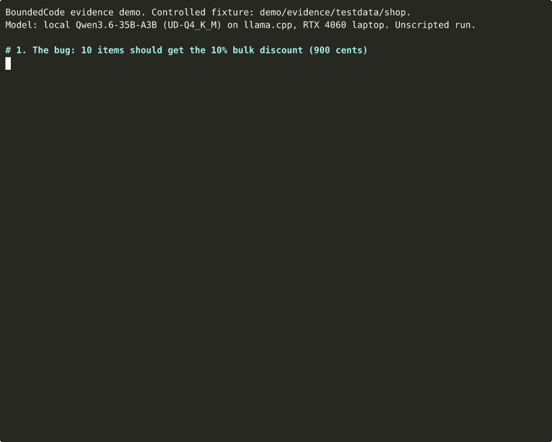

# Evidence demo

This demo shows BoundedCode's main differentiator on one small, controlled
example. A change counts as verified only when a test it adds fails on the
original code and passes with the change. A green test run is not enough.



The recording is a real run of the local Qwen3.6-35B-A3B (UD-Q4_K_M) on
llama.cpp, on an RTX 4060 laptop, recorded 2026-10-09.
- **Shortened waits:** the GIF plays 150 s of session in about 33 s. Every
  wait longer than 2 s is cut to 2 s. The timestamps on each line are the
  real ones.
- **Unedited log:**
  [`session.log`](../../docs/assets/evidence-demo/session.log) with
  [`session.timing`](../../docs/assets/evidence-demo/session.timing). Replay
  it at real speed in `docs/assets/evidence-demo` with
  `scriptreplay --timing session.timing --log-out session.log`.

## The scenario

The fixture, [`testdata/shop`](testdata/shop), is a deliberately small Go
package written for this demo. `Total` should give a 10% bulk discount to
orders of 10 or more items, but it checks `count > 10`. The existing tests
cover 5 items and 20 items, so they pass despite the bug.

| Step | What happens | In the recording |
|---|---|---|
| 1 | The bug: `go run ./cmd/quote 10` prints 1000 cents instead of 900 | yes |
| 2 | `go test ./...` passes on the buggy code | yes |
| 3 | `bcode task create … --run`: the agent edits the code in its sandbox | yes |
| 4 | BoundedCode's checks pass, but the change adds no test. BoundedCode says so and asks the agent once for a test that demonstrates the change. | yes: the model fixed the code without a test, then added one when asked |
| 5 | The change's test, put on the original code, fails (`Total = 1000, want 900`) | yes, re-run by hand with plain `git` and `go test` outside BoundedCode |
| 6 | The same test with the change passes; the fix is `count > 10` → `count >= 10`; the program now prints 900 | yes |
| 7 | BoundedCode's own record: `verify.evidence` with `"1 test(s) fail on the base and pass on the change"`, and the final state `verification=task_verified` | yes |

Step 4 depends on the model: a model that writes a test in its first attempt
skips it. Steps 5 and 6 are run by the script, not by BoundedCode. They
repeat BoundedCode's own check (step 7) independently, so a viewer does not
have to trust its output.

## What this demo shows, and what it does not

**It shows:**
- A passing test suite did not end the task. With no test that exercised the
  change, BoundedCode asked for one instead of reporting success.
- `TASK_VERIFIED` was given only after a test existed that fails on the
  original code and passes with the change. The replay in steps 5 and 6
  confirms that independently.
- The real product did this end to end: CLI, model gateway, OpenHands agent
  in the Docker sandbox, verification, and the task ledger.

**It does not show:**
- **How often it works.** This is one task, on a fixture written for the
  demo. Real-repository results are in the
  [evaluation overview](../../docs/benchmarks/README.md). On those tasks,
  BoundedCode has also marked tasks `TASK_VERIFIED` that failed hidden
  acceptance tests.
- **That the fix is correct in general.** The evidence is that the agent's
  own test captures a behaviour change. It is not proof of correctness, and
  the agent chooses which reading of the request its test checks.
- **That the model is good at coding.** The bug is trivial.
- **Speed.** The waits are shortened, and the run used a warm local server
  on one machine.
- **Anything about the scripted mode below beyond the plumbing.** Its "agent"
  is a fixed script.

## Run it yourself

Requirements:
- git, Go and python3;
- Docker with the sandbox image (`bcode setup --only sandbox`);
- for the real-model mode, an OpenAI-compatible server.

Everything runs in an isolated `BOUNDEDCODE_HOME` under `~/.cache` (Docker
Desktop shares that path), which is removed afterwards.

```bash
# Deterministic: a scripted stand-in for the model. No model or account needed.
demo/evidence/demo.sh

# A real model behind an OpenAI-compatible server you run, e.g. local llama.cpp:
DEMO_MODEL_LABEL="local Qwen3.6-35B-A3B on llama.cpp" demo/evidence/demo.sh --model http://127.0.0.1:8765

# Record: raw log and timing, asciicast, and a GIF when agg is installed
# (https://github.com/asciinema/agg; this recording used agg 1.5.0):
demo/evidence/demo.sh --model http://127.0.0.1:8765 --record /tmp/rec
```

**The scripted mode.**
- The "model" is [`scripts/smoke/fake_model.py`](../../scripts/smoke/fake_model.py)
  replaying the two commands in [`scripted-agent.txt`](scripted-agent.txt):
  first the fix only, then, on the next instruction, a test.
- The stand-in does not read BoundedCode's request for a test. It runs its
  second command on any retry.
- The recording labels this mode as scripted on its first lines.
- Everything else is the real product. Its recording is in
  [`docs/assets/evidence-demo/scripted/`](../../docs/assets/evidence-demo/scripted/),
  with the stand-in's request log.

## How the recording is made

[`demo.sh`](demo.sh) prepares the configuration and the fixture repository.
That part is not recorded. It then runs [`scenario.sh`](scenario.sh) under
util-linux `script`:
- `session.log` holds the terminal output byte for byte, with script's
  header and footer lines. `session.timing` holds the delays.
- [`to_cast.py`](to_cast.py) converts them to `session.cast`
  (asciicast v2). The conversion is lossless, and the test checks that.
- `agg --idle-time-limit 2` renders `demo.gif` from the cast. That is the
  only point where time is changed.

Privacy:
- the session runs with `TZ=UTC`;
- script's recorded command line names no local path;
- no credentials are involved (the scripted mode's API key is a placeholder
  seen only by the local stand-in).

The tests check that the published logs contain no home-directory path and
no time-zone offset.

## Automated tests

`go test ./demo/evidence` runs these tests (also part of `go test ./...`):

| Test | Checks |
|---|---|
| `TestFixturePremises` | The existing tests pass on the buggy code. `quote 10` prints 1000. A reference regression test (never given to the agent) fails on the original code with `Total = 1000, want 900`, and passes, with the existing tests, after the one-line reference fix. |
| `TestRecordedClaims` | Each step claimed above appears, in order, in each published unedited log, as the product printed it. The logs name no local path or time zone. |
| `TestCastIsLossless` | Each published `session.cast` is exactly the conversion of its `session.log`. |

The scripted scenario also runs end to end in the `first-task` job of
[`.github/workflows/smoke.yml`](../../.github/workflows/smoke.yml).

## Every run made for this recording

All runs were made on 2026-10-09 on the reference machine (Debian 13, RTX
4060 8 GB, Docker Desktop 29.8) with the binary built from `main` that day.

| Run | Model | Outcome | Published |
|---|---|---|---|
| Scripted, two harness-debugging runs | stand-in | The first ended `tests_green`: the stand-in's second command was rejected by the agent's terminal (a multi-line command), so no test was added. BoundedCode correctly reported UNVERIFIED. After that fix, `task_verified`. | no |
| Real 1 | local Qwen3.6-35B-A3B | Fix without a test → asked → added `TestTotalExactTenItems` → `task_verified`, 2 attempts, 2m20s | no: its raw log's header contained a local path, so the recording method was fixed and the scenario re-run |
| Scripted, recorded | stand-in | Fix → asked → test → `task_verified` | yes, [`scripted/`](../../docs/assets/evidence-demo/scripted/) |
| Real 2 | local Qwen3.6-35B-A3B | Fix without a test → asked → added `TestTotalExactlyTen` → `task_verified`, 2 attempts, 2m13s | yes: this README's GIF and `session.*` |

The two real runs agreed. Two runs say nothing about how often a model
behaves this way.

## The earlier demo GIF

[`docs/assets/demo.gif`](../../docs/assets/demo.gif) (2026-10-08) was also a
real local-model run on a similar bug. It showed:
- the passing tests;
- BoundedCode asking for a test;
- `task_verified`;
- the final diff.

It did not show:
- the new test failing on the original code and passing with the fix (steps
  5 and 6), nor BoundedCode's evidence record. The viewer had to infer what
  `task_verified` checked.

It also had no preserved log, and the program and repository behind it were
not in the repository. This demo replaces it in the README. It keeps the
same message and adds the parts that let a viewer check the claim.
