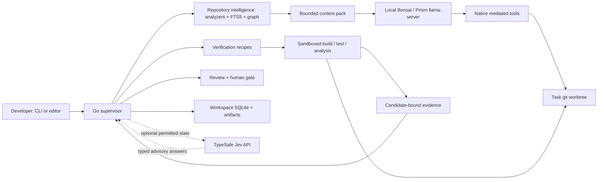

# Architecture

BoundedCode is a Go software-engineering agent built around a constrained
local inference budget. The native task path combines deterministic repository
analysis, model proposals, mediated edits, executable verification, and operator
approval. The current inference configuration is in the
[reference stack](../reference/model-stack.md).

Implementation anchors: [supervisor assembly](https://github.com/akynte/boundedcode/blob/main/internal/supervisor/supervisor.go),
[task runner](https://github.com/akynte/boundedcode/blob/main/internal/task/runner.go),
[phase loop](https://github.com/akynte/boundedcode/blob/main/internal/task/phases.go), and
[workflow state](https://github.com/akynte/boundedcode/blob/main/internal/workflow/state.go).
Executable behavior takes precedence over design records and comments.

## Components and boundaries

| Component | Input → output | Authority, resources, and failures |
|---|---|---|
| `internal/task`, `workflow`, `supervisor` | Objective, scope, repository → persisted phases and outcome | Trusted Go code. Bounds attempts, context and time; blocks on environment or uncertain state. |
| `index`, `analyzers/*`, `scipindex`, `graph` | Files/compiler facts → provenance-bearing nodes and edges | CPU/RAM and SQLite. Missing semantic tooling is reported as incomplete coverage. |
| `retrieval`, `contextpack` | Objective, graph, evidence → bounded model requests | Combines lexical anchors, graph expansion, required context, and paged reads. Admission can refuse oversized evidence. |
| `engine/native`, `firewall` | Tool calls → reads, edits, recipe results | Model arguments are untrusted. Exact file grants, protected paths and resolved-path checks mediate writes; no general shell tool. |
| `llm`, `config`, `procman` | Model requests/runtime configuration → completions and health | GPU inference over HTTP. Embedded child supervision and optional managed process switching have distinct ownership rules. |
| `recipe`, `sandbox/*` | Frozen checks + worktree → pass/fail/error/skipped | Repository code executes here. Toolchains and caches consume host resources. No available confinement means runner construction fails. |
| `ledger`, `store`, `artifacts` | Intent, results, content → durable records | Three SQLite databases per workspace; content-addressed output. Interrupted operations require inspection before reuse. |
| `broker` | Gate evidence → operator decision | Gates bind to the candidate. A changed candidate invalidates approval. |
| `judgment` | Permitted state + typed questions → probabilities | Required hosted service; advisory sites keep a deterministic answer, the six routing-capable sites fail closed; bounded authority, separate disclosure policy. |

The broker is a **human-decision broker**, not a general tool-execution service.
Native file tools execute in the trusted Go process with application-level
confinement. Verification commands are child processes under kernel/container
restrictions. The inference model itself runs in its own server; it is not
inside each task's sandbox.

## Native task lifecycle

1. **INTAKE** discovers verification presets, records baseline results, initializes
   task context, and checks prerequisites.
2. **LOCALIZE** narrows a repository map to files, signatures and targeted bodies.
   Model selections are validated and supported by deterministic retrieval.
3. **IMPACT** traverses discovered relationships and creates consumer obligations.
   Missing edges remain unknown.
4. **PLAN** asks for structured files, write grants, tests, risks and obligation
   resolutions. Validation refuses malformed or unauthorized grants.
5. **EDIT** runs a bounded tool loop in a separate git worktree. Its transcript,
   tool evidence and pending actions are persisted.
6. **VERIFY** executes the frozen presets and applicable declared checks. The
   runner stores summarized findings and full output against a candidate hash.
7. **REVIEW** makes a separate model call with the plan, impact, diff and results.
   Rejection can return the task to editing or localization.
8. **FINALIZE** checks candidate identity, records a task memory card, opens the
   configured human gate, and commits on the task branch after approval.

Failure paths distinguish repair, re-planning, re-localization, unavailable
environment, and exhausted budget. The phase machine is separate from ledger
task states: `pending`, `running`, `paused`, `blocked`, `review`,
`accepted`, `failed`, and `abandoned`.
[Verification details](verification.md) · [Recovery](crash-recovery.md).

## Two execution paths

**Native CLI:** `bcode task run` owns the task loop and edits a separate worktree.
The usual setup uses Bonsai for localization/planning, coding and review.
A separate reviewer conversation is not a separate model or an independent
proof.

**Editor/MCP:** OpenCode can call repository, editing and supervision tools.
These can operate on the editor's existing checkout. A recorded `VERIFIED`
review does not retroactively gate edits already made there.
`bcode opencode run` adds process confinement; `bcode opencode setup` only
configures integration. See [OpenCode](../how-to/use-with-opencode.md).
OpenCode is not the native task engine. The optional ACP bridge is a byte
transport for an explicitly configured external agent, not an implementation of
the native workflow.

## Runtime lifecycle

The reference walkthrough starts Prism's server separately and uses
`inference.mode: external`. The server stays resident until its operator stops
it. `bcode api` is optional for native CLI tasks.

With `embedded`, `bcode api` starts the configured executable using
profile-derived arguments, waits for health, applies restart/backoff budgets,
and terminates owned process groups on shutdown.

A provider with a `process` stanza uses the managed-provider path. It pins the
server executable by SHA-256, serializes requests, and stops the previously owned
process before starting another. An occupied external endpoint is refused,
never killed. The reference configuration uses one generator and does not
require model rotation. These locks are process-local.
[Resource strategy](8gb-runtime.md).

## Repository and persistence

Each workspace has `index.db` (code graph and FTS), `ledger.db` (task state,
journal, evidence and worktree leases), and `telemetry.db`. Large artifacts
live separately under content hashes. Cache keys and stored records are scoped
to workspace identity. The `storescope` analyzer enforces persistence boundaries
with explicit exemptions; it does not prohibit every filesystem write outside
`store`.

Indexing and verification do not require a generative model. Optional sidecars
and LSP processes spend host RAM to improve semantic coverage or freshness.
[Repository intelligence](repository-intelligence.md) ·
[Storage layout](../reference/storage-layout.md).

## What the architecture does not guarantee

Verification runs on a writable task worktree, not an immutable snapshot or
separate always-on verification service. Runtime profiles describe memory and
concurrency targets; they are not a machine-wide VRAM scheduler. Saved-slot
directories and cleanup exist, but the ordinary client does not implement a
llama.cpp slot save/restore protocol.

Deterministic checks enforce a minimum evidence contract. They cannot prove the
user's entire intent, and tests can be incomplete or weakened. Model review and
optional Jev findings add fallible scrutiny.
[Trust boundaries](trust-boundaries.md) · [Known limits](known-limitations.md).
