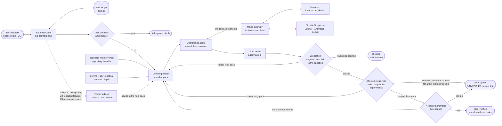

# Verification

BoundedCode decides whether a task is done with deterministic checks that
run in the sandbox, not with the agent's own judgement. This page is the
reference for what those checks establish and where they stop. For the
security side (what the sandbox prevents), see the
[sandbox design](../design/sandbox.md).

This is not formal verification. A `TASK_VERIFIED` result is evidence that a
test captures a change in behaviour, not proof that the change is correct.

## Result states

| State | Meaning |
|---|---|
| **builds** | It compiles and lints. |
| **`tests_green`** | The repository's checks pass. On its own this is weak evidence: in the initial validation, patches that changed nothing passed the existing tests. A task that ends here is reported as UNVERIFIED and is never presented as a verified merge candidate. |
| **`TASK_VERIFIED`** | The checks pass **and** there is behavioural evidence (below). In a multi-repository task, every gRPC, protobuf or OpenAPI link that the change affects must also be `compatible`. |

## Behavioural evidence

A test that the change adds or modifies (test code or test data) must:

1. **fail on the base commit with the changed tests laid over it,**
2. **not fail on the base commit without them** (a control run, so a test
   that was already failing does not count), and
3. **pass with the change.** For Go, each such test is run on the change
   and must report PASS rather than fail or skip (on `main`, unreleased as
   of v0.1.0-alpha.4). For other languages, the whole test stage must pass
   on the change.

Go failures are compared per test function. For other languages,
failures are compared per test where the runner names them (pytest,
unittest, cargo, Maven, Gradle, RSpec, minitest, PHPUnit, CTest, Meson).
Otherwise they are compared per stage: the stage must fail with the changed
tests and pass without them. JavaScript is always compared per stage.

These do not count as evidence:

- a changed Go test that does not compile on the base (it calls code the
  change adds): it shows that an API exists, not that it behaves as asked;
- a stage that times out on the base.

When there is no evidence, the agent is asked once for a test that
demonstrates the change. If it still cannot provide one, the task ends
`tests_green`.

## Task flow

Before each verification, the control plane checks the worktree's git
integrity and commits a checkpoint. A passing change that touches a
cross-service contract without updating the other side gets one more round
to check it.

A task that runs out of attempts, tokens or time is blocked, not failed:
`task resume` continues it.

## Cross-repository compatibility (experimental)

In a multi-repository task, each gRPC, protobuf or OpenAPI link that the
change affects gets a result: `compatible`, `broken` or `untested`. Each
result is tied to exact commits.

- **How links are checked:** the dependent repository's own checks run in
  the sandbox against the other repositories' candidate commits. Coverage,
  or a run with the OpenAPI operation removed, must show that the checks
  actually execute the link.
- **What each result does:** a broken link fails verification and is
  retried. An untested link withholds `TASK_VERIFIED`.
- **Where to see it:** `task status`, `verify --full` and the TUI's
  Verification tab show the report.
- **What is covered:** gRPC and protobuf sides written in Go (a single
  module at the repository root, a `go test` stage, generated code
  committed in a task repository), and OpenAPI sides whose tests read the
  specification. Every other shape is reported `untested`.
- **What is not checked:** a client is never run against the real server.
- **Status:** tested on fixtures only, not on real tasks.
- **Turning it off:** `repointel.compat_gate: false` turns the gate off.
  Untested links then no longer withhold `TASK_VERIFIED`.

[Design and limits](../design/cross-repo-compatibility.md).

## Gate integrity

The verification config is read from the base commit, so the agent cannot
change which stages run. The diff-scope check fails a change that touches
secret paths or protected paths (`.boundedcode/`, `.github/workflows/`,
`.gitlab-ci.yml`, `.gitmodules`, CODEOWNERS).

The agent can still edit tests and build scripts in its worktree, for
example a `package.json` `test` script. The stages catch mistakes, not an
adversarial agent: only human review, or hidden acceptance tests in a
benchmark, catches that. See the sandbox's
[residual risks](../design/sandbox.md#residual-risks-known-accepted-for-now).

## Known limits

Measured or reproduced. The
[readiness audit](../public-launch/readiness-audit.md) has the probes.

- **Single runs.** Each evidence run happens once, so a flaky test that
  happens to fail on the base can count as evidence.
- **New API in dynamic languages.** A Python or JavaScript test that fails
  on the base only because a function or module the change adds is missing
  currently counts as evidence. Examples: `AttributeError`,
  `ModuleNotFoundError`, `TypeError: … is not a function`. In Go the
  equivalent case is rejected.
- **New API in general.** A change that only adds new API needs a test that
  also runs on the original code (Go), or it ends `tests_green`.
- **Custom Go stages.** A custom Go stage in `.boundedcode/verification.yaml`
  is treated as a non-Go stage unless its first `requires` entry is
  `go.mod`.
- **Test data.** Changed test data is attributed to every test in the Go
  package that reads it, or to the whole stage for other languages.
- **Multi-repository evidence.** In a multi-repository task, evidence from
  one changed repository verifies the task.
- **Readings of the request.** A test can only demonstrate the reading of a
  request that the agent chose. In development runs, tasks were
  `TASK_VERIFIED` yet failed hidden acceptance tests:
  - 3 in the final failure-driven run, where the issue allowed another
    reading or the hidden test required details the issue did not state;
  - 2 in the targeted pass's development checks.

  See [§C of the failure-driven report](../benchmarks/failure-driven-engineering-2026-10.md#c-verification-why-false-passes-happened-what-prevents-them-now)
  and [verification honesty](../benchmarks/targeted-engineering-pass-2026-10.md#verification-honesty-in-the-development-checks).
- **Adversarial tests.** A deliberately adversarial test, for example one
  that detects where it runs, is caught only by review.

## Configuration

Built-in presets cover Go, JavaScript/TypeScript, Python, Rust, Java (Maven,
Gradle), C/C++ (CMake, Meson, Autotools, Make), Ruby and PHP without
configuration. A repository can override them in
`.boundedcode/verification.yaml`. See the
[configuration reference](configuration.md#repository-verification-boundedcodeverificationyaml).

Verification runs offline, so a project's dependencies must already be
installed. They can be in the checkout (`node_modules`, `.venv`, `vendor`)
or in this machine's package caches (Go, Cargo, Maven, Gradle).
